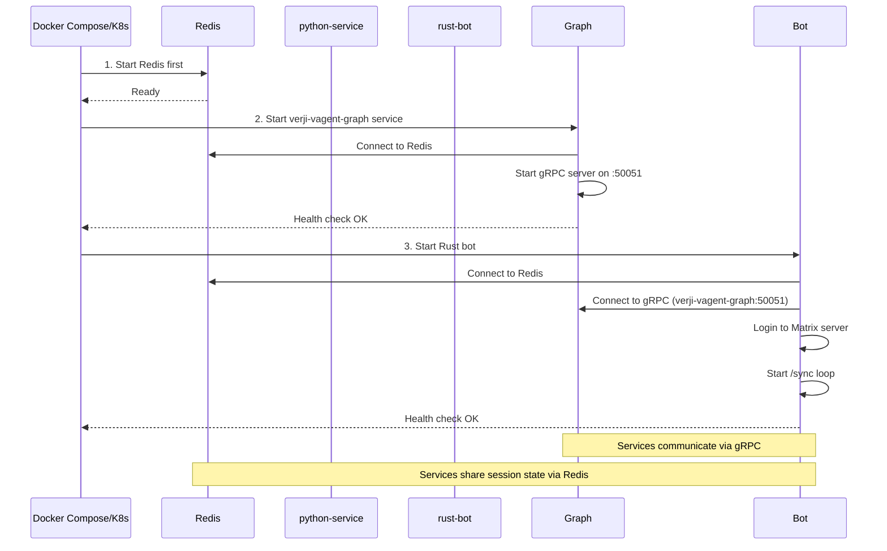

# Matrix Chatbot Architecture Analysis
**Rust + Python/LangGraph Integration with HITL Support**

---

## Executive Summary

✅ **Overall Architecture**: Sound with recommended modifications
🔄 **IPC Recommendation**: Replace WebSocket+JSON-RPC with **gRPC**
🔑 **Session Management**: Hierarchical session IDs with Redis backing
🎯 **HITL Strategy**: Admin room coordination via Redis pubsub

---

## Architecture Overview

### Current Design (Your Proposal)
```
Matrix Server (Verji)
    ↓ /sync protocol
Verji vAgent Bot (matrix-rust-sdk)
    ↓ WebSocket + JSON-RPC (?)
Verji vAgent Graph (LangGraph with HITL)
```

### Recommended Design
```
┌──────────────────────────────────────────────────────────────┐
│                        Matrix Server                         │
│                    (Verji via /sync)                        │
└────────────────────┬─────────────────────────────────────────┘
                     │ Matrix Client-Server API
                     ▼
┌──────────────────────────────────────────────────────────────┐
│            Verji vAgent Bot Service                          │
│                  (matrix-rust-sdk)                          │
│  ┌────────────────────────────────────────────────────────┐ │
│  │ • Matrix event handling (messages, typing, etc.)       │ │
│  │ • Session ID management (room:thread:user)             │ │
│  │ • HITL coordination (admin room integration)           │ │
│  │ • Message routing & formatting                          │ │
│  └────────────────────────────────────────────────────────┘ │
└────────────────────┬─────────────────────────────────────────┘
                     │ gRPC (bidirectional streaming)
                     ▼
┌──────────────────────────────────────────────────────────────┐
│          Verji vAgent Graph (LangGraph Service)              │
│  ┌────────────────────────────────────────────────────────┐ │
│  │ • LangGraph workflow execution                         │ │
│  │ • LLM orchestration                                    │ │
│  │ • HITL node handling                                   │ │
│  │ • State persistence (via Redis checkpointer)          │ │
│  └────────────────────────────────────────────────────────┘ │
└────────────────────┬─────────────────────────────────────────┘
                     │
                     ▼
┌──────────────────────────────────────────────────────────────┐
│                      Redis                                   │
│  • Session state storage                                    │
│  • LangGraph checkpoints (resume after HITL)                │
│  • HITL pubsub channels                                     │
│  • Message history/context                                  │
└──────────────────────────────────────────────────────────────┘
```

---

## 1. Inter-Process Communication (IPC)

### ❌ WebSocket + JSON-RPC - NOT RECOMMENDED

**Why not:**
- No type safety between Rust and Python
- Manual connection handling and reconnection logic
- JSON serialization overhead
- Difficult to implement bidirectional streaming for HITL
- No built-in load balancing or service discovery

### ✅ gRPC with Bidirectional Streaming - RECOMMENDED

**Why gRPC:**
- **Type safety**: Protocol buffers ensure contract between Rust/Python
- **Bidirectional streaming**: Perfect for HITL (human-in-the-loop) flows
- **Performance**: Binary protocol, much faster than JSON
- **Mature ecosystem**:
  - Rust: `tonic` (excellent async support)
  - Python: `grpcio` (official implementation)
- **Built-in features**: Reconnection, load balancing, health checks
- **Multiplexing**: Single connection handles multiple concurrent sessions

### Sample Protocol Definition

```protobuf
// chatbot.proto
syntax = "proto3";

package chatbot;

service ChatbotService {
  // Bidirectional stream for interactive conversations
  rpc ProcessMessage(stream BotMessage) returns (stream BotResponse);

  // For HITL feedback submission
  rpc SubmitHumanFeedback(HumanFeedback) returns (FeedbackAck);

  // Health check
  rpc HealthCheck(HealthCheckRequest) returns (HealthCheckResponse);
}

message BotMessage {
  string session_id = 1;           // Format: room_id:thread_id:user_id
  string room_id = 2;              // Matrix room ID
  string user_id = 3;              // Matrix user ID
  string message = 4;              // User's message content
  map<string, string> context = 5; // Additional context (room name, etc.)
  int64 timestamp = 6;             // Unix timestamp
}

message BotResponse {
  string session_id = 1;

  oneof response_type {
    TextMessage text = 2;          // Regular text response
    HITLRequest hitl_request = 3;  // Request for human feedback
    StreamChunk chunk = 4;         // Streaming response chunk
    ErrorMessage error = 5;        // Error occurred
  }
}

message TextMessage {
  string content = 1;
  bool is_final = 2;               // Is this the final response?
}

message HITLRequest {
  string question = 1;             // Question for human reviewer
  repeated string options = 2;     // Optional: predefined choices
  string context = 3;              // Additional context for reviewer
  int32 timeout_seconds = 4;       // How long to wait for response
}

message StreamChunk {
  string content = 1;              // Partial content (for streaming)
  int32 chunk_index = 2;           // Order of chunks
}

message ErrorMessage {
  string error_code = 1;
  string message = 2;
}

message HumanFeedback {
  string session_id = 1;
  string response = 2;             // Human's response/decision
  map<string, string> metadata = 3;
}

message FeedbackAck {
  bool success = 1;
  string message = 2;
}

message HealthCheckRequest {}

message HealthCheckResponse {
  string status = 1;
  int32 active_sessions = 2;
}
```

### Alternative: Message Queue (Secondary Recommendation)

If you need **complete decoupling** or **horizontal scaling**:

```
Rust Bot --> Redis Streams/RabbitMQ <-- Python Service
```

**Good for:**
- Multiple bot instances (load balancing)
- Fault tolerance (messages persist in queue)
- Service independence (either side can restart)

**Downsides:**
- More complex infrastructure
- Harder to implement synchronous HITL feedback loops
- Higher latency than gRPC

---

## 2. Session Management Strategy

### The Challenge

Your bot needs to handle:
- **Multiple Matrix rooms** simultaneously
- **Multiple users** per room
- **Threaded conversations** (Matrix supports threads)
- **Concurrent HITL requests** across different sessions
- **LangGraph state** that must persist and resume

### Solution: Hierarchical Session IDs

#### Session ID Format
```
{room_id}:{thread_id}:{user_id}
```

**Examples:**
- Main room conversation: `!abc123:matrix.org:main:@user:matrix.org`
- Threaded conversation: `!abc123:matrix.org:$thread456:@user:matrix.org`
- DM conversation: `!dm789:matrix.org:main:@user:matrix.org`

#### Rust Implementation

```rust
use serde::{Deserialize, Serialize};

#[derive(Debug, Clone, Serialize, Deserialize, Hash, Eq, PartialEq)]
struct SessionId {
    room_id: String,                // Matrix room ID
    thread_id: Option<String>,      // Matrix thread ID (if threaded)
    user_id: String,                // User initiating conversation
}

impl SessionId {
    fn new(room_id: String, thread_id: Option<String>, user_id: String) -> Self {
        Self { room_id, thread_id, user_id }
    }

    fn to_key(&self) -> String {
        match &self.thread_id {
            Some(thread) => format!("{}:{}:{}", self.room_id, thread, self.user_id),
            None => format!("{}:main:{}", self.room_id, self.user_id)
        }
    }

    fn from_key(key: &str) -> Result<Self, SessionError> {
        let parts: Vec<&str> = key.split(':').collect();
        if parts.len() < 3 {
            return Err(SessionError::InvalidFormat);
        }

        Ok(Self {
            room_id: parts[0].to_string(),
            thread_id: if parts[1] == "main" { None } else { Some(parts[1].to_string()) },
            user_id: parts[2].to_string(),
        })
    }
}

#[derive(Debug, Serialize, Deserialize)]
struct Session {
    id: SessionId,
    graph_state: serde_json::Value,  // LangGraph state (JSON)
    created_at: chrono::DateTime<chrono::Utc>,
    updated_at: chrono::DateTime<chrono::Utc>,
    hitl_pending: bool,
    metadata: HashMap<String, String>,
}
```

#### Redis-Based Session Store

```rust
use redis::AsyncCommands;
use tokio::sync::RwLock;

struct SessionManager {
    redis: redis::Client,
    cache: RwLock<HashMap<String, Session>>, // In-memory cache
}

impl SessionManager {
    async fn get_or_create_session(&self, session_id: &SessionId) -> Result<Session, SessionError> {
        let key = format!("session:{}", session_id.to_key());

        // Check in-memory cache first
        {
            let cache = self.cache.read().await;
            if let Some(session) = cache.get(&key) {
                return Ok(session.clone());
            }
        }

        // Check Redis
        let mut con = self.redis.get_async_connection().await?;

        if let Ok(state) = con.get::<_, String>(&key).await {
            let session: Session = serde_json::from_str(&state)?;

            // Update cache
            self.cache.write().await.insert(key, session.clone());

            return Ok(session);
        }

        // Create new session
        let session = Session {
            id: session_id.clone(),
            graph_state: serde_json::Value::Null,
            created_at: chrono::Utc::now(),
            updated_at: chrono::Utc::now(),
            hitl_pending: false,
            metadata: HashMap::new(),
        };

        // Store with TTL (24 hours)
        let serialized = serde_json::to_string(&session)?;
        con.set_ex(&key, &serialized, 86400).await?;

        // Cache it
        self.cache.write().await.insert(key, session.clone());

        Ok(session)
    }

    async fn update_session(&self, session: &Session) -> Result<(), SessionError> {
        let key = format!("session:{}", session.id.to_key());
        let mut con = self.redis.get_async_connection().await?;

        let serialized = serde_json::to_string(session)?;
        con.set_ex(&key, &serialized, 86400).await?;

        // Update cache
        self.cache.write().await.insert(key, session.clone());

        Ok(())
    }

    async fn delete_session(&self, session_id: &SessionId) -> Result<(), SessionError> {
        let key = format!("session:{}", session_id.to_key());
        let mut con = self.redis.get_async_connection().await?;

        con.del(&key).await?;
        self.cache.write().await.remove(&key);

        Ok(())
    }

    async fn list_active_sessions(&self) -> Result<Vec<SessionId>, SessionError> {
        let mut con = self.redis.get_async_connection().await?;
        let keys: Vec<String> = con.keys("session:*").await?;

        Ok(keys.into_iter()
            .filter_map(|k| k.strip_prefix("session:").map(String::from))
            .filter_map(|k| SessionId::from_key(&k).ok())
            .collect())
    }
}
```

#### Python Side

```python
import redis.asyncio as redis
import json
from typing import Optional, Dict
from datetime import datetime, timedelta

class SessionManager:
    def __init__(self, redis_url: str = "redis://localhost"):
        self.redis = redis.from_url(redis_url, decode_responses=True)

    async def get_session(self, session_id: str) -> Optional[Dict]:
        """Retrieve session from Redis"""
        key = f"session:{session_id}"
        state = await self.redis.get(key)
        return json.loads(state) if state else None

    async def get_or_create_session(self, session_id: str) -> Dict:
        """Get existing session or create new one"""
        session = await self.get_session(session_id)
        if session:
            return session

        session = {
            "id": session_id,
            "graph_state": None,
            "created_at": datetime.utcnow().isoformat(),
            "updated_at": datetime.utcnow().isoformat(),
            "hitl_pending": False,
            "metadata": {}
        }

        await self.update_session(session_id, session)
        return session

    async def update_session(self, session_id: str, session: Dict):
        """Update session in Redis with TTL"""
        key = f"session:{session_id}"
        session["updated_at"] = datetime.utcnow().isoformat()
        await self.redis.setex(key, timedelta(days=1), json.dumps(session))

    async def get_graph_state(self, session_id: str) -> Optional[Dict]:
        """Get LangGraph state for this session"""
        session = await self.get_session(session_id)
        return session.get("graph_state") if session else None

    async def update_graph_state(self, session_id: str, state: Dict):
        """Update LangGraph state"""
        session = await self.get_or_create_session(session_id)
        session["graph_state"] = state
        await self.update_session(session_id, session)

    async def delete_session(self, session_id: str):
        """Delete session from Redis"""
        key = f"session:{session_id}"
        await self.redis.delete(key)
```

---

## 3. HITL (Human-in-the-Loop) Implementation

### Architecture Pattern

```
┌─────────────────────────────────────────────────────────┐
│                     Matrix Room (User)                  │
│  User: "Help me with X"                                 │
│  Bot: "Processing..." (typing indicator)                │
└─────────────────────────────────────────────────────────┘
                    ▼
┌─────────────────────────────────────────────────────────┐
│                Verji vAgent Bot (matrix-rust-sdk)               │
│  1. Receive message event                               │
│  2. Extract session_id (room:thread:user)               │
│  3. Send to Python via gRPC stream                      │
└─────────────────────────────────────────────────────────┘
                    ▼ gRPC
┌─────────────────────────────────────────────────────────┐
│            Python Service (LangGraph)                   │
│  1. Load graph state from Redis                         │
│  2. Execute LangGraph nodes                             │
│  3. Reach HITL node → pause graph                       │
│  4. Send HITLRequest back to Rust via gRPC              │
└─────────────────────────────────────────────────────────┘
                    ▼ gRPC
┌─────────────────────────────────────────────────────────┐
│                Rust Bot (HITL handler)                  │
│  1. Receive HITLRequest                                 │
│  2. Post question to admin Matrix room                  │
│  3. Subscribe to Redis pubsub: "hitl:{session_id}"      │
│  4. Wait for admin response...                          │
└─────────────────────────────────────────────────────────┘
                    ▼
┌─────────────────────────────────────────────────────────┐
│              Matrix Admin Room                          │
│  Bot: "❓ Approval needed for session ABC:"             │
│       "User asks: 'Delete all records?'"                │
│       "Approve? (yes/no)"                               │
│                                                          │
│  Admin: "no - too risky"                                │
└─────────────────────────────────────────────────────────┘
                    ▼
┌─────────────────────────────────────────────────────────┐
│                Rust Bot (receives admin msg)            │
│  1. Parse admin response                                │
│  2. Publish to Redis: "hitl:{session_id}"               │
│  3. Wake up HITL handler (from pubsub)                  │
│  4. Send feedback to Python via gRPC                    │
└─────────────────────────────────────────────────────────┘
                    ▼ gRPC
┌─────────────────────────────────────────────────────────┐
│            Python Service (resumes)                     │
│  1. Receive human feedback                              │
│  2. Resume LangGraph from checkpoint                    │
│  3. Update state with feedback                          │
│  4. Complete workflow                                   │
│  5. Return final response via gRPC                      │
└─────────────────────────────────────────────────────────┘
                    ▼ gRPC
┌─────────────────────────────────────────────────────────┐
│                Rust Bot (sends final reply)             │
│  Send response to original Matrix room                  │
└─────────────────────────────────────────────────────────┘
```

### Rust Implementation

```rust
use tokio::sync::mpsc;
use redis::AsyncCommands;

struct HITLManager {
    redis: redis::Client,
    admin_room_id: OwnedRoomId,
    matrix_client: matrix_sdk::Client,
}

impl HITLManager {
    async fn request_human_feedback(
        &self,
        session_id: &SessionId,
        question: &str,
        context: &str,
    ) -> Result<String, HITLError> {
        // 1. Post question to admin room
        let formatted_msg = format!(
            "❓ **Human feedback needed**\n\n\
             Session: `{}`\n\
             Context: {}\n\n\
             **Question:** {}\n\n\
             Reply to this message with your response.",
            session_id.to_key(),
            context,
            question
        );

        let msg_event = self.matrix_client
            .room_send(
                &self.admin_room_id,
                RoomMessageEventContent::text_markdown(&formatted_msg),
                None,
            )
            .await?;

        // 2. Mark session as awaiting HITL
        let mut con = self.redis.get_async_connection().await?;
        let hitl_key = format!("hitl_pending:{}", session_id.to_key());
        con.set_ex(&hitl_key, msg_event.event_id.as_str(), 3600).await?;

        // 3. Subscribe to Redis pubsub channel for this session
        let channel = format!("hitl:{}", session_id.to_key());
        let mut pubsub = self.redis.get_async_connection().await?.into_pubsub();
        pubsub.subscribe(&channel).await?;

        // 4. Wait for human response (with timeout)
        let timeout = tokio::time::Duration::from_secs(3600); // 1 hour timeout
        let response = tokio::time::timeout(timeout, async {
            let mut stream = pubsub.on_message();
            while let Some(msg) = stream.next().await {
                if let Ok(payload) = msg.get_payload::<String>() {
                    return payload;
                }
            }
            String::new()
        }).await;

        match response {
            Ok(feedback) if !feedback.is_empty() => {
                // Clean up
                con.del(&hitl_key).await?;
                Ok(feedback)
            }
            _ => {
                // Timeout or empty response
                con.del(&hitl_key).await?;
                Err(HITLError::Timeout)
            }
        }
    }

    async fn handle_admin_response(
        &self,
        room_id: &OwnedRoomId,
        event: &OriginalSyncRoomMessageEvent,
    ) -> Result<(), HITLError> {
        // Check if this is the admin room
        if room_id != &self.admin_room_id {
            return Ok(());
        }

        // Extract the text content
        let text = match &event.content.msgtype {
            MessageType::Text(text_content) => &text_content.body,
            _ => return Ok(()),
        };

        // Check if this is a reply to a HITL request
        // (you'd look at in_reply_to or thread_id in the actual implementation)

        // For simplicity, let's assume we track which session is pending
        // In reality, you'd parse the thread or look up the original event

        // Publish response to Redis pubsub
        let mut con = self.redis.get_async_connection().await?;

        // Find pending HITL sessions
        let pending_keys: Vec<String> = con.keys("hitl_pending:*").await?;

        for key in pending_keys {
            if let Ok(event_id) = con.get::<_, String>(&key).await {
                // Check if this response is for this HITL request
                // (implementation detail: check thread_id or in_reply_to)

                let session_id_str = key.strip_prefix("hitl_pending:").unwrap();
                let channel = format!("hitl:{}", session_id_str);

                // Publish the human's response
                con.publish(&channel, text.as_str()).await?;

                break;
            }
        }

        Ok(())
    }
}
```

### Python LangGraph with HITL

```python
from langgraph.graph import StateGraph, END
from langgraph.checkpoint.redis import RedisSaver
from typing import TypedDict, Annotated
import operator

class State(TypedDict):
    session_id: str
    messages: Annotated[list, operator.add]
    proposed_action: str
    approval: str | None
    final_response: str

async def create_chatbot_graph(grpc_stub, session_manager):
    """Create LangGraph with HITL support"""

    async def process_query_node(state: State):
        """Process user query and determine if action needed"""
        # Your LLM logic here
        messages = state['messages']

        # Simulate: determine if risky action
        if "delete" in messages[-1].lower() or "remove all" in messages[-1].lower():
            state['proposed_action'] = f"Execute: {messages[-1]}"
            return state

        # Safe query - respond directly
        state['final_response'] = "Safe response here"
        return state

    async def hitl_approval_node(state: State):
        """HITL node - request human approval"""
        session_id = state['session_id']
        proposed_action = state['proposed_action']

        # Send HITL request to Rust bot via gRPC
        hitl_request = chatbot_pb2.HITLRequest(
            question=f"Approve this action: {proposed_action}?",
            context=f"User query: {state['messages'][-1]}",
            timeout_seconds=3600
        )

        response = chatbot_pb2.BotResponse(
            session_id=session_id,
            hitl_request=hitl_request
        )

        # Send via gRPC stream
        await grpc_stub.send_response(response)

        # Wait for human feedback via Redis pubsub
        feedback = await wait_for_hitl_response(session_id)

        state['approval'] = feedback
        return state

    async def execute_action_node(state: State):
        """Execute action based on approval"""
        if state.get('approval'):
            # Check approval
            if 'yes' in state['approval'].lower() or 'approve' in state['approval'].lower():
                state['final_response'] = f"Action approved and executed: {state['proposed_action']}"
            else:
                state['final_response'] = f"Action rejected by human reviewer: {state['approval']}"
        else:
            # No approval needed
            state['final_response'] = "Action executed (no approval needed)"

        return state

    async def wait_for_hitl_response(session_id: str) -> str:
        """Wait for human feedback via Redis pubsub"""
        pubsub = session_manager.redis.pubsub()
        channel = f"hitl:{session_id}"

        await pubsub.subscribe(channel)

        async for message in pubsub.listen():
            if message['type'] == 'message':
                data = message['data']
                if isinstance(data, bytes):
                    return data.decode()
                return str(data)

        return "timeout"

    def should_request_approval(state: State) -> str:
        """Conditional edge: determine if approval needed"""
        if state.get('proposed_action'):
            return "approve"
        return "execute"

    # Build the graph
    workflow = StateGraph(State)

    workflow.add_node("process_query", process_query_node)
    workflow.add_node("need_approval", hitl_approval_node)
    workflow.add_node("execute_action", execute_action_node)

    workflow.set_entry_point("process_query")

    # Conditional routing
    workflow.add_conditional_edges(
        "process_query",
        should_request_approval,
        {
            "approve": "need_approval",
            "execute": "execute_action"
        }
    )

    workflow.add_edge("need_approval", "execute_action")
    workflow.add_edge("execute_action", END)

    # Use Redis checkpointer for state persistence
    checkpointer = RedisSaver(session_manager.redis)

    return workflow.compile(checkpointer=checkpointer)
```

---

## 4. Complete Implementation Example

### Rust Bot Main Handler

```rust
use matrix_sdk::{
    Client, Room,
    ruma::events::room::message::{
        MessageType, OriginalSyncRoomMessageEvent,
        RoomMessageEventContent,
    },
    config::SyncSettings,
};
use tonic::transport::Channel;

struct MatrixChatbot {
    matrix_client: Client,
    grpc_client: ChatbotServiceClient<Channel>,
    session_manager: Arc<SessionManager>,
    hitl_manager: Arc<HITLManager>,
}

impl MatrixChatbot {
    async fn handle_message(
        &self,
        room: Room,
        event: &OriginalSyncRoomMessageEvent,
    ) -> Result<(), BotError> {
        // Ignore messages from the bot itself
        if event.sender == self.matrix_client.user_id().unwrap() {
            return Ok(());
        }

        // Check if admin response (HITL)
        if room.room_id() == &self.hitl_manager.admin_room_id {
            return self.hitl_manager.handle_admin_response(room.room_id(), event).await
                .map_err(|e| BotError::HITLError(e));
        }

        // Extract message text
        let text = match &event.content.msgtype {
            MessageType::Text(text_content) => &text_content.body,
            _ => return Ok(()), // Ignore non-text messages
        };

        // Create session ID
        let session_id = SessionId::new(
            room.room_id().to_string(),
            event.content.relates_to.as_ref()
                .and_then(|r| r.thread.as_ref())
                .map(|t| t.event_id.to_string()),
            event.sender.to_string(),
        );

        // Send typing indicator
        room.typing_notice(matrix_sdk::ruma::api::client::typing::Typing::Yes(
            std::time::Duration::from_secs(60)
        )).await?;

        // Call Python service via gRPC
        let request = BotMessage {
            session_id: session_id.to_key(),
            room_id: room.room_id().to_string(),
            user_id: event.sender.to_string(),
            message: text.clone(),
            context: HashMap::new(),
            timestamp: event.origin_server_ts.as_secs().into(),
        };

        let mut stream_request = tokio_stream::iter(vec![request]);
        let mut response_stream = self.grpc_client
            .clone()
            .process_message(stream_request)
            .await?
            .into_inner();

        // Handle responses
        while let Some(response) = response_stream.message().await? {
            match response.response_type {
                Some(ResponseType::Text(text_msg)) => {
                    // Send final text response
                    room.send(RoomMessageEventContent::text_plain(&text_msg.content), None).await?;

                    // Stop typing indicator
                    room.typing_notice(matrix_sdk::ruma::api::client::typing::Typing::No).await?;
                }

                Some(ResponseType::HitlRequest(hitl)) => {
                    // Handle HITL request
                    let feedback = self.hitl_manager
                        .request_human_feedback(&session_id, &hitl.question, &hitl.context)
                        .await?;

                    // Send feedback back to Python
                    self.grpc_client
                        .clone()
                        .submit_human_feedback(HumanFeedback {
                            session_id: session_id.to_key(),
                            response: feedback,
                            metadata: HashMap::new(),
                        })
                        .await?;
                }

                Some(ResponseType::StreamChunk(chunk)) => {
                    // Optional: handle streaming responses
                    // Could edit a message incrementally
                }

                Some(ResponseType::Error(err)) => {
                    room.send(
                        RoomMessageEventContent::text_plain(
                            &format!("Error: {}", err.message)
                        ),
                        None
                    ).await?;
                    room.typing_notice(matrix_sdk::ruma::api::client::typing::Typing::No).await?;
                }

                None => {}
            }
        }

        Ok(())
    }

    async fn run(&self) -> Result<(), BotError> {
        // Login
        self.matrix_client.login_username("bot_user", "password").send().await?;

        // Setup message handler
        self.matrix_client.add_event_handler(|event: OriginalSyncRoomMessageEvent, room: Room, client: Client| async move {
            // Handle message
        });

        // Start syncing
        let sync_settings = SyncSettings::default().timeout(std::time::Duration::from_secs(30));
        self.matrix_client.sync(sync_settings).await?;

        Ok(())
    }
}
```

### Python gRPC Server

```python
import grpc
from concurrent import futures
import asyncio
from chatbot_pb2_grpc import ChatbotServiceServicer, add_ChatbotServiceServicer_to_server
import chatbot_pb2

class ChatbotServiceImpl(ChatbotServiceServicer):
    def __init__(self, session_manager, langgraph_app):
        self.session_manager = session_manager
        self.app = langgraph_app
        self.active_streams = {}  # session_id -> response queue

    async def ProcessMessage(self, request_iterator, context):
        """Bidirectional streaming RPC"""
        async for bot_message in request_iterator:
            session_id = bot_message.session_id

            # Get or create session
            session = await self.session_manager.get_or_create_session(session_id)

            # Run LangGraph
            config = {"configurable": {"thread_id": session_id}}

            async for event in self.app.astream_events(
                {"messages": [bot_message.message]},
                config=config,
                version="v1"
            ):
                # Handle different event types
                if event["event"] == "on_chat_model_stream":
                    # Stream chunks
                    chunk = event["data"]["chunk"]
                    yield chatbot_pb2.BotResponse(
                        session_id=session_id,
                        chunk=chatbot_pb2.StreamChunk(content=chunk)
                    )

                elif event["event"] == "hitl_request":
                    # HITL needed
                    yield chatbot_pb2.BotResponse(
                        session_id=session_id,
                        hitl_request=chatbot_pb2.HITLRequest(
                            question=event["data"]["question"],
                            context=event["data"]["context"]
                        )
                    )

            # Send final response
            final_state = await self.app.aget_state(config)
            if final_state.values.get("final_response"):
                yield chatbot_pb2.BotResponse(
                    session_id=session_id,
                    text=chatbot_pb2.TextMessage(
                        content=final_state.values["final_response"],
                        is_final=True
                    )
                )

    async def SubmitHumanFeedback(self, request, context):
        """Receive human feedback and resume graph"""
        session_id = request.session_id
        feedback = request.response

        # Publish to Redis so LangGraph can receive it
        await self.session_manager.redis.publish(
            f"hitl:{session_id}",
            feedback
        )

        return chatbot_pb2.FeedbackAck(success=True, message="Feedback received")

async def serve():
    session_manager = SessionManager()
    graph = await create_chatbot_graph(None, session_manager)

    server = grpc.aio.server(futures.ThreadPoolExecutor(max_workers=10))
    add_ChatbotServiceServicer_to_server(
        ChatbotServiceImpl(session_manager, graph),
        server
    )

    server.add_insecure_port('[::]:50051')
    await server.start()
    print("gRPC server started on port 50051")
    await server.wait_for_termination()

if __name__ == '__main__':
    asyncio.run(serve())
```

---

## 5. Technology Stack Summary

### Rust Bot
| Component | Library | Purpose |
|-----------|---------|---------|
| Matrix SDK | `matrix-rust-sdk` | Matrix protocol handling |
| gRPC Client | `tonic` | Communication with Python service |
| Session Store | `redis` (async) | Session state persistence |
| Async Runtime | `tokio` | Async task execution |
| Serialization | `serde`, `serde_json` | JSON handling |
| Observability | `tracing` | Logging and metrics |

### Python Service
| Component | Library | Purpose |
|-----------|---------|---------|
| LangGraph | `langgraph` | Workflow orchestration |
| LLM Integration | `langchain` | LLM calls (OpenAI, Anthropic, etc.) |
| gRPC Server | `grpcio` | RPC server |
| Session Store | `redis` (async) | Session state + pubsub |
| Checkpointer | `langgraph.checkpoint.redis` | Graph state persistence |

### Infrastructure
- **Redis**: Session state, checkpoints, HITL pubsub
- **Protocol Buffers**: Type-safe contract between services

---

## 6. Deployment Architecture: Separate Services vs Spawn/Fork

### ✅ RECOMMENDED: Separate Deployments (Docker Containers)

**Each service runs independently in its own container.** The Rust bot and Python service do NOT spawn/fork each other.

```
┌─────────────────────────────────────────────────────────┐
│                   Docker Host / K8s                     │
│                                                          │
│  ┌──────────────────────┐      ┌───────────────────┐  │
│  │  Container: rust-bot │◄────►│ Container: redis  │  │
│  │                      │      │                   │  │
│  │  - Connects to       │      │  - Session store  │  │
│  │    Matrix server     │      │  - Checkpoints    │  │
│  │  - Makes gRPC calls  │      │  - Pubsub         │  │
│  │    to python-service │      │                   │  │
│  │  - Independent       │      └───────────────────┘  │
│  │    lifecycle         │               ▲              │
│  └──────────┬───────────┘               │              │
│             │                           │              │
│             │ gRPC over                 │              │
│             │ Docker network            │              │
│             ▼                           │              │
│  ┌─────────────────────────┐           │              │
│  │ Container: python-      │───────────┘              │
│  │           service       │                          │
│  │                         │                          │
│  │  - gRPC server on       │                          │
│  │    port 50051           │                          │
│  │  - LangGraph execution  │                          │
│  │  - Independent lifecycle│                          │
│  └─────────────────────────┘                          │
└─────────────────────────────────────────────────────────┘
```

### Why Separate Deployments? (Not Spawn/Fork)

| Aspect | Separate Containers | Spawn/Fork Process |
|--------|--------------------|--------------------|
| **Independence** | ✅ Each service restarts independently | ❌ Parent failure kills child |
| **Scaling** | ✅ Scale Rust and Python separately | ❌ Coupled scaling |
| **Updates** | ✅ Update one without touching other | ❌ Must redeploy parent |
| **Language isolation** | ✅ Each uses optimal runtime (Rust binary, Python interpreter) | ⚠️ Rust spawning Python subprocess is fragile |
| **Resource limits** | ✅ Set CPU/memory per service | ❌ Shared parent limits |
| **Monitoring** | ✅ Separate health checks, logs, metrics | ⚠️ Complex to monitor child process |
| **Crash recovery** | ✅ Docker/K8s restarts failed container | ⚠️ Parent must implement child supervision |
| **Development** | ✅ Run services separately during dev | ❌ Always need parent running |

### Startup Flow



### Service Communication

**The services communicate over the Docker network (or K8s cluster network):**

1. **verji-vagent-bot** makes **gRPC client calls** to `verji-vagent-graph:50051`
2. **verji-vagent-graph** listens on **gRPC server** at `:50051`
3. Both services connect to **Redis** at `redis:6379`

**No process spawning, no forking. Just network calls.**

---

## 7. Deployment Considerations

### Docker Compose Example

```yaml
version: '3.8'

services:
  redis:
    image: redis:7-alpine
    ports:
      - "6379:6379"
    volumes:
      - redis_data:/data
    command: redis-server --appendonly yes

  verji-vagent-bot:
    build:
      context: ./verji-vagent-bot
      dockerfile: Dockerfile
    depends_on:
      - redis
      - python-service
    environment:
      - MATRIX_HOMESERVER=https://matrix.org
      - MATRIX_USER=@bot:matrix.org
      - MATRIX_PASSWORD=${BOT_PASSWORD}
      - REDIS_URL=redis://redis:6379
      - GRPC_ENDPOINT=http://python-service:50051
      - ADMIN_ROOM_ID=!adminroom:matrix.org
    restart: unless-stopped

  verji-vagent-graph:
    build:
      context: ./verji-vagent-graph
      dockerfile: Dockerfile
    depends_on:
      - redis
    environment:
      - REDIS_URL=redis://redis:6379
      - OPENAI_API_KEY=${OPENAI_API_KEY}
      - GRPC_PORT=50051
    ports:
      - "50051:50051"
    restart: unless-stopped

volumes:
  redis_data:
```

### Scaling Considerations

**Horizontal Scaling:**
- ✅ Multiple Rust bot instances (handle different rooms)
- ✅ Multiple Python service instances (load balance via gRPC)
- ⚠️ Shared Redis for session state (single point of failure)

**Redis HA:**
- Use Redis Sentinel or Redis Cluster for high availability
- Consider Redis Streams instead of pubsub for better durability

---

## 7. Local Development with Tilt

### Why Tilt for Multi-Service Development

Tilt provides the **best developer experience** for local Kubernetes development:
- **Hot reload** for both Rust and Python without full rebuilds
- **Live updates** - sync code changes to running containers instantly
- **Resource view** - single dashboard to monitor all services
- **Local Kubernetes** - test in environment matching production
- **Fast feedback** - see errors immediately in unified UI

### Tiltfile Configuration

```python
# Tiltfile
# Load extensions
load('ext://namespace', 'namespace_create')
load('ext://helm_resource', 'helm_resource', 'helm_repo')

# Configuration
config.define_string_list('to-run', args=True)
cfg = config.parse()
groups = {
    'infra': ['redis'],
    'backend': ['python-service', 'rust-bot'],
    'all': ['redis', 'python-service', 'rust-bot']
}

# Determine which services to run
services = cfg.get('to-run', ['all'])
if 'all' in services:
    services = groups['all']
else:
    expanded = []
    for svc in services:
        expanded.extend(groups.get(svc, [svc]))
    services = expanded

# Create namespace
namespace_create('chatbot-dev')

#──────────────────────────────────────────────────────────
# 1. REDIS (Infrastructure)
#──────────────────────────────────────────────────────────

if 'redis' in services:
    k8s_yaml('''
apiVersion: v1
kind: Service
metadata:
  name: redis
  namespace: chatbot-dev
spec:
  ports:
    - port: 6379
      targetPort: 6379
  selector:
    app: redis
---
apiVersion: apps/v1
kind: Deployment
metadata:
  name: redis
  namespace: chatbot-dev
spec:
  replicas: 1
  selector:
    matchLabels:
      app: redis
  template:
    metadata:
      labels:
        app: redis
    spec:
      containers:
      - name: redis
        image: redis:7-alpine
        ports:
        - containerPort: 6379
        command: ["redis-server", "--appendonly", "yes"]
        volumeMounts:
        - name: redis-data
          mountPath: /data
      volumes:
      - name: redis-data
        emptyDir: {}
''')

    k8s_resource('redis',
        port_forwards='6379:6379',
        labels=['infra'],
        resource_deps=[],
    )

#──────────────────────────────────────────────────────────
# 2. PYTHON SERVICE (LangGraph + gRPC Server)
#──────────────────────────────────────────────────────────

if 'python-service' in services:
    # Build Docker image with live_update for hot reload
    docker_build(
        'chatbot/verji-vagent-graph',
        context='./verji-vagent-graph',
        dockerfile='./verji-vagent-graph/Dockerfile.dev',
        live_update=[
            # Sync Python source files
            sync('./verji-vagent-graph/src', '/app/src'),

            # Restart on changes (Python picks up changes automatically)
            run('echo "Code synced - Python will auto-reload"'),
        ],
        # Use cache for faster rebuilds
        build_args={'BUILDKIT_INLINE_CACHE': '1'},
    )

    k8s_yaml('''
apiVersion: v1
kind: ConfigMap
metadata:
  name: python-service-config
  namespace: chatbot-dev
data:
  REDIS_URL: "redis://redis:6379"
  GRPC_PORT: "50051"
  LOG_LEVEL: "debug"
---
apiVersion: v1
kind: Service
metadata:
  name: python-service
  namespace: chatbot-dev
spec:
  ports:
    - port: 50051
      targetPort: 50051
      name: grpc
  selector:
    app: python-service
---
apiVersion: apps/v1
kind: Deployment
metadata:
  name: python-service
  namespace: chatbot-dev
spec:
  replicas: 1
  selector:
    matchLabels:
      app: python-service
  template:
    metadata:
      labels:
        app: python-service
    spec:
      containers:
      - name: python-service
        image: chatbot/python-service
        ports:
        - containerPort: 50051
        envFrom:
        - configMapRef:
            name: python-service-config
        env:
        - name: OPENAI_API_KEY
          valueFrom:
            secretKeyRef:
              name: chatbot-secrets
              key: openai-api-key
        readinessProbe:
          exec:
            command: ["/bin/grpc_health_probe", "-addr=:50051"]
          initialDelaySeconds: 5
          periodSeconds: 10
''')

    k8s_resource('python-service',
        port_forwards='50051:50051',
        labels=['backend'],
        resource_deps=['redis'],
        # Auto-reload on code changes
        auto_init=True,
        trigger_mode=TRIGGER_MODE_AUTO,
    )

#──────────────────────────────────────────────────────────
# 3. RUST BOT (Matrix Client + gRPC Client)
#──────────────────────────────────────────────────────────

if 'rust-bot' in services:
    # Custom build for Rust with incremental compilation
    custom_build(
        'chatbot/verji-vagent-bot',
        command='cd rust-bot && docker build -f Dockerfile.dev -t $EXPECTED_REF .',
        deps=['./verji-vagent-bot/src', './verji-vagent-bot/Cargo.toml', './verji-vagent-bot/Cargo.lock'],
        # Live update: sync source and recompile
        live_update=[
            sync('./verji-vagent-bot/src', '/app/src'),

            # Incremental recompile (much faster than full rebuild)
            run('cd /app && cargo build --release',
                trigger=['./verji-vagent-bot/src']),

            # Restart the binary
            restart_container(),
        ],
    )

    k8s_yaml('''
apiVersion: v1
kind: ConfigMap
metadata:
  name: rust-bot-config
  namespace: chatbot-dev
data:
  REDIS_URL: "redis://redis:6379"
  GRPC_ENDPOINT: "http://python-service:50051"
  RUST_LOG: "debug,matrix_sdk=info"
  ADMIN_ROOM_ID: "!adminroom:matrix.org"
---
apiVersion: v1
kind: Service
metadata:
  name: rust-bot
  namespace: chatbot-dev
spec:
  ports:
    - port: 8080
      targetPort: 8080
      name: metrics
  selector:
    app: rust-bot
---
apiVersion: apps/v1
kind: Deployment
metadata:
  name: rust-bot
  namespace: chatbot-dev
spec:
  replicas: 1
  selector:
    matchLabels:
      app: rust-bot
  template:
    metadata:
      labels:
        app: rust-bot
    spec:
      containers:
      - name: rust-bot
        image: chatbot/rust-bot
        envFrom:
        - configMapRef:
            name: rust-bot-config
        env:
        - name: MATRIX_HOMESERVER
          value: "https://matrix-client.matrix.org"
        - name: MATRIX_USER
          valueFrom:
            secretKeyRef:
              name: chatbot-secrets
              key: matrix-user
        - name: MATRIX_PASSWORD
          valueFrom:
            secretKeyRef:
              name: chatbot-secrets
              key: matrix-password
        readinessProbe:
          httpGet:
            path: /health
            port: 8080
          initialDelaySeconds: 10
          periodSeconds: 15
''')

    k8s_resource('rust-bot',
        port_forwards='8080:8080',
        labels=['backend'],
        resource_deps=['redis', 'python-service'],
        auto_init=True,
        trigger_mode=TRIGGER_MODE_AUTO,
    )

#──────────────────────────────────────────────────────────
# SECRETS (for local development)
#──────────────────────────────────────────────────────────

# Load from local .env file or use defaults
k8s_yaml(local('cat <<EOF\n' +
'''apiVersion: v1
kind: Secret
metadata:
  name: chatbot-secrets
  namespace: chatbot-dev
type: Opaque
stringData:
  matrix-user: "{matrix_user}"
  matrix-password: "{matrix_password}"
  openai-api-key: "{openai_key}"
EOF'''.format(
    matrix_user=os.environ.get('MATRIX_USER', '@bot:matrix.org'),
    matrix_password=os.environ.get('MATRIX_PASSWORD', 'dev_password'),
    openai_key=os.environ.get('OPENAI_API_KEY', 'sk-test'),
)))

#──────────────────────────────────────────────────────────
# BUTTONS & EXTENSIONS
#──────────────────────────────────────────────────────────

# Add buttons to Tilt UI for common tasks
local_resource(
    'proto-compile',
    cmd='./scripts/gen-proto.sh',
    deps=['./proto/chatbot.proto'],
    labels=['tools'],
    auto_init=False,  # Manual trigger
)

local_resource(
    'integration-tests',
    cmd='pytest tests/integration/ -v',
    resource_deps=['redis', 'python-service', 'rust-bot'],
    labels=['tests'],
    auto_init=False,  # Manual trigger
)

# Add logs aggregation
local_resource(
    'logs',
    serve_cmd='stern --namespace chatbot-dev . --tail=50',
    labels=['tools'],
    auto_init=False,
)

# Add button to reset Redis
local_resource(
    'redis-flush',
    cmd='kubectl exec -n chatbot-dev deploy/redis -- redis-cli FLUSHALL',
    resource_deps=['redis'],
    labels=['tools'],
    auto_init=False,
)
```

### Dockerfile.dev for Python (Hot Reload)

```dockerfile
# python-service/Dockerfile.dev
FROM python:3.11-slim

WORKDIR /app

# Install dependencies
COPY pyproject.toml poetry.lock ./
RUN pip install poetry && \
    poetry config virtualenvs.create false && \
    poetry install --no-root

# Copy source (will be overridden by live_update)
COPY src/ ./src/

# Install grpc health probe
RUN wget -qO/bin/grpc_health_probe https://github.com/grpc-ecosystem/grpc-health-probe/releases/download/v0.4.19/grpc_health_probe-linux-amd64 && \
    chmod +x /bin/grpc_health_probe

# Hot reload with watchfiles
CMD ["python", "-m", "watchfiles", "--ignore-paths", "**/__pycache__", "src.main.main()", "src/"]
```

### Dockerfile.dev for Rust (Incremental Builds)

```dockerfile
# rust-bot/Dockerfile.dev
FROM rust:1.75-slim as builder

WORKDIR /app

# Install dependencies
RUN apt-get update && apt-get install -y \
    pkg-config libssl-dev protobuf-compiler && \
    rm -rf /var/lib/apt/lists/*

# Cache dependencies by building empty project first
COPY Cargo.toml Cargo.lock ./
RUN mkdir src && \
    echo "fn main() {}" > src/main.rs && \
    cargo build --release && \
    rm -rf src

# Copy source (will be overridden by live_update)
COPY src/ ./src/

# Build actual application
RUN cargo build --release

# Runtime stage
FROM debian:bookworm-slim

RUN apt-get update && apt-get install -y \
    ca-certificates libssl3 && \
    rm -rf /var/lib/apt/lists/*

WORKDIR /app

# Copy binary
COPY --from=builder /app/target/release/rust-bot /usr/local/bin/rust-bot

# Health check endpoint
EXPOSE 8080

CMD ["rust-bot"]
```

### Usage Commands

```bash
# Start all services
tilt up

# Start only infrastructure
tilt up -- --to-run infra

# Start specific services
tilt up -- --to-run redis python-service

# View logs in terminal
tilt logs python-service

# Follow all logs
tilt logs -f

# Trigger manual resources
tilt trigger proto-compile
tilt trigger integration-tests
tilt trigger redis-flush

# Open web UI
# Tilt automatically opens http://localhost:10350

# Stop all
tilt down
```

### Tilt UI Features You'll Use Daily

**In the Tilt Web UI (http://localhost:10350):**

1. **Resource Overview**
   - See all services at a glance (green = healthy, red = error)
   - CPU/Memory usage per service
   - Logs for each service in separate tabs

2. **Logs Streaming**
   - Color-coded logs per service
   - Search/filter logs in real-time
   - Click to expand stack traces

3. **Manual Triggers** (buttons you added)
   - "proto-compile" - Regenerate protobuf code
   - "integration-tests" - Run full test suite
   - "redis-flush" - Clear Redis cache

4. **Live Updates**
   - See when code syncs happen (no full rebuild!)
   - Python changes: < 1 second
   - Rust changes: ~10-30 seconds (incremental compile)

### Development Workflow

```bash
# Morning: Start your cluster
tilt up

# Code in your editor - changes auto-sync!
# Edit python-service/src/main.py → sees changes in ~1 sec
# Edit rust-bot/src/main.rs → recompiles in ~15 sec

# Need fresh proto files?
# Click "proto-compile" button in Tilt UI

# Testing a fix?
# Click "integration-tests" button to run tests

# Redis acting weird?
# Click "redis-flush" button to clear cache

# End of day
tilt down
```

### Advanced: Conditional Development Modes

Add to Tiltfile for even more flexibility:

```python
# Tiltfile (additional configuration)

# Toggle: Use local code OR remote image
dev_mode = os.environ.get('TILT_DEV_MODE', 'local') == 'local'

if dev_mode:
    # Local development with hot reload
    docker_build('chatbot/verji-vagent-graph', ...)
else:
    # Use pre-built image (faster startup, no hot reload)
    k8s_yaml(kustomize('./k8s/overlays/dev'))

# Toggle: Use local Matrix homeserver for testing
use_local_matrix = os.environ.get('USE_LOCAL_MATRIX', 'false') == 'true'

if use_local_matrix:
    # Add local Synapse server
    k8s_yaml('''
apiVersion: apps/v1
kind: Deployment
metadata:
  name: synapse
  namespace: chatbot-dev
# ... local Matrix server config
''')
    k8s_resource('synapse', port_forwards='8008:8008', labels=['infra'])

# Add metrics/observability (optional)
if os.environ.get('ENABLE_OBSERVABILITY', 'false') == 'true':
    helm_resource('prometheus',
        'prometheus-community/prometheus',
        namespace='chatbot-dev',
        labels=['observability'],
    )
```

### .env File for Local Secrets

```bash
# .env (in project root, gitignored)
MATRIX_USER=@bot-dev:matrix.org
MATRIX_PASSWORD=your_dev_bot_password
OPENAI_API_KEY=sk-your-key-here

# Optional toggles
TILT_DEV_MODE=local
USE_LOCAL_MATRIX=false
ENABLE_OBSERVABILITY=false
```

### Benefits Over Docker Compose

| Feature | Tilt + K8s | Docker Compose |
|---------|-----------|----------------|
| **Hot reload** | ✅ Sub-second for Python, ~15s for Rust | ❌ Full rebuild required |
| **Resource monitoring** | ✅ Built-in UI with metrics | ⚠️ Requires separate tools |
| **Production parity** | ✅ Same K8s manifests as prod | ❌ Different config format |
| **Multi-service logs** | ✅ Unified, searchable UI | ⚠️ Must use `docker-compose logs` |
| **Selective startup** | ✅ `tilt up -- --to-run redis` | ⚠️ Must comment out services |
| **Manual triggers** | ✅ Buttons in UI | ❌ Must run commands manually |
| **Integration tests** | ✅ Run from UI with deps | ⚠️ Separate script needed |

---

## 8. Recommendations Summary

| Decision | Recommendation | Reasoning |
|----------|---------------|-----------|
| **IPC Protocol** | ✅ gRPC (bidirectional streaming) | Type safety, performance, streaming support |
| **Session Storage** | ✅ Redis | Persistence, pubsub, multi-instance support |
| **Session ID Format** | ✅ `room:thread:user` | Unique per conversation context |
| **HITL Pattern** | ✅ Admin room + Redis pubsub | Clean separation, scalable |
| **State Persistence** | ✅ Redis checkpointer (LangGraph) | Built-in resume capability |
| **Deployment** | ✅ Docker Compose → K8s | Easy local dev, scalable production |

---

## 8. Next Steps

1. **Prototype**: Start with simple gRPC communication
2. **Session Management**: Implement Redis-based session store
3. **Basic LangGraph**: Create simple workflow without HITL
4. **Add HITL**: Implement admin room + pubsub pattern
5. **Error Handling**: Add timeouts, retries, error recovery
6. **Monitoring**: Add metrics (Prometheus), logging, tracing
7. **Testing**: Unit tests, integration tests, load tests
8. **Production**: Deploy with Redis HA, multiple instances

---

## Conclusion

✅ **Your architecture is sound** with the recommended modifications:

**Core strengths:**
- Rust for Matrix (excellent choice)
- Python/LangGraph for AI logic (correct separation)

**Improvements needed:**
- Replace WebSocket+JSON-RPC with **gRPC**
- Implement **hierarchical session IDs**
- Use **Redis** for session state and HITL coordination
- Design **admin room pattern** for HITL workflows

This architecture will give you:
- **Type safety** between Rust and Python
- **Scalability** (multiple bot instances, horizontal scaling)
- **Reliability** (session persistence, graph checkpoints)
- **Clean HITL** (async human feedback without blocking)

Good luck with your chatbot! 🤖
