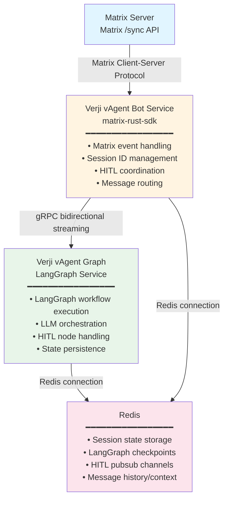
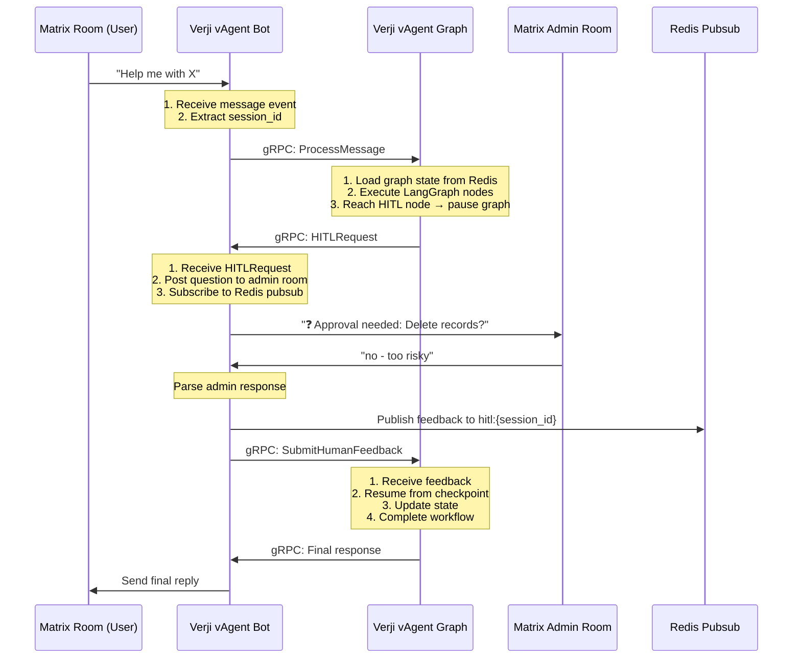

# Verji AI Agent Architecture
**Production Matrix Chatbot with Rust + Python/LangGraph + HITL Support**

---

## Overview

Verji AI Agent is a production-ready Matrix chatbot that combines:
- **Verji vAgent Bot** (Rust + matrix-rust-sdk): Matrix client for message handling and HITL coordination
- **Verji vAgent Graph** (Python + LangGraph): AI workflow orchestration with LLM integration
- **Redis**: Shared state store for sessions, checkpoints, and pubsub
- **gRPC**: Type-safe bidirectional communication using Protocol Buffers

## System Architecture



---

## 1. Service Communication (gRPC)

### Protocol Definition

All inter-service communication uses gRPC with Protocol Buffers for type safety and performance.

**Key features:**
- **Type safety**: Protocol buffers enforce contracts between Rust and Python
- **Bidirectional streaming**: Enables real-time HITL flows
- **Performance**: Binary protocol, faster than JSON
- **Mature ecosystem**: `tonic` (Rust) and `grpcio` (Python)

### Protocol Buffer Schema

The actual protocol is defined in `proto/chatbot.proto`:

```protobuf
syntax = "proto3";

package chatbot;

service ChatbotService {
  // Bidirectional stream for interactive conversations
  rpc ProcessMessage(stream BotMessage) returns (stream BotResponse);

  // For HITL feedback submission
  rpc SubmitHumanFeedback(HumanFeedback) returns (FeedbackAck);

  // Health check
  rpc HealthCheck(HealthCheckRequest) returns (HealthCheckResponse);
}

message BotMessage {
  string session_id = 1;           // Format: room_id:thread_id:user_id
  string room_id = 2;              // Matrix room ID
  string user_id = 3;              // Matrix user ID
  string message = 4;              // User's message content
  map<string, string> context = 5; // Additional context
  int64 timestamp = 6;             // Unix timestamp
}

message BotResponse {
  string session_id = 1;

  oneof response_type {
    TextMessage text = 2;          // Regular text response
    HITLRequest hitl_request = 3;  // Request for human feedback
    StreamChunk chunk = 4;         // Streaming response chunk
    ErrorMessage error = 5;        // Error occurred
  }
}

message HITLRequest {
  string question = 1;             // Question for human reviewer
  repeated string options = 2;     // Optional: predefined choices
  string context = 3;              // Additional context for reviewer
  int32 timeout_seconds = 4;       // How long to wait for response
}

// ... other message definitions
```

**After editing the protocol:**
```bash
./scripts/gen-proto.sh
# Generates Rust code in verji-vagent-bot/src/proto/
# Generates Python code in verji-vagent-graph/src/proto/
```

---

## 2. Session Management

### Hierarchical Session IDs

Session IDs uniquely identify each conversation context:

```
{room_id}:{thread_id}:{user_id}
```

**Examples:**
- Main room: `!abc123:matrix.org:main:@user:matrix.org`
- Threaded: `!abc123:matrix.org:$thread456:@user:matrix.org`
- DM: `!dm789:matrix.org:main:@user:matrix.org`

### Rust Implementation

```rust
#[derive(Debug, Clone, Serialize, Deserialize, Hash, Eq, PartialEq)]
struct SessionId {
    room_id: String,                // Matrix room ID
    thread_id: Option<String>,      // Matrix thread ID (if threaded)
    user_id: String,                // User initiating conversation
}

impl SessionId {
    fn to_key(&self) -> String {
        match &self.thread_id {
            Some(thread) => format!("{}:{}:{}", self.room_id, thread, self.user_id),
            None => format!("{}:main:{}", self.room_id, self.user_id)
        }
    }
}
```

### Redis Storage

**Session keys:**
- `session:{session_id}` - Session state (TTL: 24 hours)
- `hitl_pending:{session_id}` - HITL requests awaiting response
- `hitl:{session_id}` - Pubsub channel for HITL feedback

---

## 3. Human-in-the-Loop (HITL) Pattern

### HITL Workflow



### Key HITL Implementation Details

1. **Timeout**: Default 1 hour (configurable per request)
2. **Redis Pubsub**: Coordinates async feedback between services
3. **LangGraph Checkpoints**: Enable workflow resumption after HITL
4. **Admin Room**: Configured via `ADMIN_ROOM_ID` environment variable

---

## 4. Deployment Architecture

### Service Independence

**Each service runs independently** - no process spawning or forking.

```mermaid
graph TB
    subgraph k8s["Docker Host / Kubernetes"]
        bot[verji-vagent-bot<br/>━━━━━━━━━━━━━━━<br/>• Matrix client<br/>• gRPC client<br/>• HITL coordinator]

        graph[verji-vagent-graph<br/>━━━━━━━━━━━━━━━<br/>• gRPC server<br/>• LangGraph execution<br/>• LLM integration]

        redis[Redis<br/>━━━━━━━━━━━━━━━<br/>• Session store<br/>• Checkpoints<br/>• Pubsub]

        bot <-->|gRPC| graph
        bot <-->|Redis protocol| redis
        graph <-->|Redis protocol| redis
    end

    style bot fill:#fff4e1
    style graph fill:#e8f5e9
    style redis fill:#fce4ec
```

### Startup Order

1. **Redis** - Start first
2. **verji-vagent-graph** - Start gRPC server on `:50051`
3. **verji-vagent-bot** - Connect to graph and Matrix

### Communication

- **verji-vagent-bot** → `verji-vagent-graph:50051` (gRPC client)
- **verji-vagent-graph** → `:50051` (gRPC server)
- **Both** → `redis:6379` (Redis client)

---

## 5. Technology Stack

### Verji vAgent Bot (Rust)

| Component | Library | Purpose |
|-----------|---------|---------|
| Matrix SDK | `matrix-rust-sdk` | Matrix protocol handling |
| gRPC Client | `tonic` | Communication with graph service |
| Session Store | `redis` (async) | Session state persistence |
| Async Runtime | `tokio` | Async task execution |
| Serialization | `serde`, `serde_json` | JSON handling |
| Observability | `tracing` | Logging and metrics |

### Verji vAgent Graph (Python)

| Component | Library | Purpose |
|-----------|---------|---------|
| LangGraph | `langgraph` | Workflow orchestration |
| LLM Integration | `langchain` | LLM calls (OpenAI, Anthropic) |
| gRPC Server | `grpcio` | RPC server |
| Session Store | `redis` (async) | Session state + pubsub |
| Checkpointer | `langgraph.checkpoint.redis` | Graph state persistence |

### Infrastructure

- **Redis 7**: Session state, checkpoints, HITL pubsub
- **Protocol Buffers**: Type-safe contract between services
- **Kubernetes**: Orchestration (local via Tilt, production via K8s)

---

## 6. Local Development with Tilt

### Why Tilt

Tilt provides the best developer experience for this multi-service architecture:
- **Hot reload**: Python (< 1 sec), Rust (~15 sec incremental)
- **Unified dashboard**: All services, logs, metrics in one place
- **Production parity**: Same K8s manifests as production
- **Manual triggers**: Proto compilation, tests, Redis flush

### Quick Start

```bash
# Prerequisites: Kubernetes cluster (minikube/kind/Docker Desktop)
minikube start

# Start Tilt
tilt up

# Tilt UI opens at http://localhost:10350
# Edit code - changes sync automatically!
```

### Port Forwards

- Redis: `localhost:6379`
- verji-vagent-graph (gRPC): `localhost:50051`
- verji-vagent-bot (metrics): `localhost:8080`

### Manual Triggers

Click buttons in Tilt UI:
- **proto-compile**: Regenerate gRPC code from `.proto`
- **integration-tests**: Run full test suite
- **redis-flush**: Clear all Redis data

---

## 7. Production Deployment

### Docker Compose

For production deployment (not for local development):

```yaml
version: '3.8'

services:
  redis:
    image: redis:7-alpine
    command: redis-server --appendonly yes
    volumes:
      - redis_data:/data

  verji-vagent-graph:
    build:
      context: ./verji-vagent-graph
      dockerfile: Dockerfile
    depends_on:
      - redis
    environment:
      - REDIS_URL=redis://redis:6379
      - GRPC_PORT=50051
      - OPENAI_API_KEY=${OPENAI_API_KEY}
      - ANTHROPIC_API_KEY=${ANTHROPIC_API_KEY}
    ports:
      - "50051:50051"

  verji-vagent-bot:
    build:
      context: ./verji-vagent-bot
      dockerfile: Dockerfile
    depends_on:
      - redis
      - verji-vagent-graph
    environment:
      - MATRIX_HOMESERVER=${MATRIX_HOMESERVER}
      - MATRIX_USER=${MATRIX_USER}
      - MATRIX_PASSWORD=${MATRIX_PASSWORD}
      - ADMIN_ROOM_ID=${ADMIN_ROOM_ID}
      - REDIS_URL=redis://redis:6379
      - GRPC_ENDPOINT=http://verji-vagent-graph:50051

volumes:
  redis_data:
```

### Kubernetes

For production K8s deployment, use manifests in `k8s/overlays/prod/`.

---

## 8. Implementation Examples

### Rust: Session Management

```rust
use redis::AsyncCommands;
use tokio::sync::RwLock;

struct SessionManager {
    redis: redis::Client,
    cache: RwLock<HashMap<String, Session>>,
}

impl SessionManager {
    async fn get_or_create_session(&self, session_id: &SessionId) -> Result<Session> {
        let key = format!("session:{}", session_id.to_key());

        // Check cache first
        if let Some(session) = self.cache.read().await.get(&key) {
            return Ok(session.clone());
        }

        // Check Redis
        let mut con = self.redis.get_async_connection().await?;
        if let Ok(state) = con.get::<_, String>(&key).await {
            let session: Session = serde_json::from_str(&state)?;
            self.cache.write().await.insert(key, session.clone());
            return Ok(session);
        }

        // Create new session with 24h TTL
        let session = Session::new(session_id.clone());
        let serialized = serde_json::to_string(&session)?;
        con.set_ex(&key, &serialized, 86400).await?;
        self.cache.write().await.insert(key, session.clone());

        Ok(session)
    }
}
```

### Python: LangGraph with HITL

```python
from langgraph.graph import StateGraph, END
from langgraph.checkpoint.redis import RedisSaver

async def create_chatbot_graph(session_manager):
    async def process_query_node(state):
        # LLM processing logic
        if needs_approval(state['messages'][-1]):
            state['proposed_action'] = extract_action(state['messages'][-1])
        return state

    async def hitl_approval_node(state):
        # Send HITL request via gRPC
        hitl_request = HITLRequest(
            question=f"Approve: {state['proposed_action']}?",
            context=state['messages'][-1],
            timeout_seconds=3600
        )

        # Wait for human feedback via Redis pubsub
        feedback = await wait_for_hitl_response(state['session_id'])
        state['approval'] = feedback
        return state

    # Build graph
    workflow = StateGraph(State)
    workflow.add_node("process_query", process_query_node)
    workflow.add_node("need_approval", hitl_approval_node)
    workflow.add_node("execute_action", execute_action_node)

    # Use Redis checkpointer for resumability
    checkpointer = RedisSaver(session_manager.redis)
    return workflow.compile(checkpointer=checkpointer)
```

---

## 9. Key Design Decisions

| Decision | Choice | Rationale |
|----------|--------|-----------|
| **IPC Protocol** | gRPC | Type safety, bidirectional streaming, performance |
| **Session Storage** | Redis | Persistence, pubsub, multi-instance support |
| **Session ID Format** | `room:thread:user` | Unique per conversation context |
| **HITL Pattern** | Admin room + Redis pubsub | Clean separation, async coordination |
| **State Persistence** | Redis checkpointer | Built-in LangGraph resume capability |
| **Deployment** | Separate containers | Independence, scaling, monitoring |
| **Development** | Tilt + K8s | Hot reload, production parity |

---

## 10. Monitoring & Operations

### Health Checks

- **verji-vagent-bot**: HTTP endpoint at `:8080/health`
- **verji-vagent-graph**: gRPC health probe on `:50051`
- **Redis**: Standard Redis `PING` command

### Logging

- **Structured logs**: Both services emit JSON logs to stdout
- **Centralized**: Collected by K8s/Docker and sent to log aggregation
- **Correlation**: All logs include `session_id` for tracing

### Metrics

- **verji-vagent-bot**: Prometheus-compatible metrics at `:8080/metrics`
- **verji-vagent-graph**: Custom metrics via gRPC interceptors
- **Redis**: Standard Redis metrics

---

## 11. Scaling Considerations

### Horizontal Scaling

- **verji-vagent-bot**: Multiple instances can handle different rooms
- **verji-vagent-graph**: Load balance via gRPC
- **Redis**: Use Redis Cluster or Sentinel for HA

### Performance

- **gRPC connection pooling**: Reuse connections between services
- **Redis pipelining**: Batch Redis operations where possible
- **LangGraph checkpointing**: Minimize checkpoint frequency

---

## Conclusion

This architecture provides:
- **Type safety** between Rust and Python via gRPC
- **Scalability** through independent service deployment
- **Reliability** via session persistence and graph checkpoints
- **Clean HITL** implementation with async human feedback
- **Developer experience** with Tilt hot reload

The system is production-ready and designed for cloud-native deployment while maintaining excellent local development workflows.
