# Verji AI Agent Architecture
**Production Matrix Chatbot with Rust + Python/LangGraph + HITL Support**

---

## Overview

Verji AI Agent is a production-ready Matrix chatbot that combines:
- **Verji vAgent Bot** (Rust + matrix-rust-sdk): Matrix client for message handling and HITL coordination
- **Verji vAgent Graph** (Python + LangGraph): AI workflow orchestration with LLM integration
- **Redis**: Shared state store for sessions, checkpoints, and pubsub
- **HTTP/JSON**: Simple, debuggable communication between services

## System Architecture


---

## 1. Service Communication (HTTP/JSON)

### Why JSON Over Protobuf

**Design Decision:** Use JSON over HTTP for inter-service communication instead of gRPC/Protobuf.

**Rationale:**
- **No performance bottleneck**: LLM API calls (seconds) and HITL workflows (minutes) dominate latency
- **Development velocity**: No code generation, no proto compilation, faster iteration
- **Debugging simplicity**: Human-readable logs, `curl`-friendly, immediate visibility in Tilt
- **Ecosystem alignment**: Matrix (JSON), LangGraph checkpoints (JSON), Redis (JSON), LLM APIs (JSON)
- **Horizontal scaling**: Performance issues solved by adding instances, not micro-optimizations

### HTTP API Design

**REST-style endpoints with Server-Sent Events (SSE) for streaming:**

#### POST /api/v1/process_message
Send a message to the LangGraph workflow for processing.

```json
// Request
{
  "session_id": "!abc123:matrix.org:main:@user:matrix.org",
  "room_id": "!abc123:matrix.org",
  "user_id": "@user:matrix.org",
  "message": "Help me delete old records",
  "context": {
    "room_name": "Support Room",
    "user_display_name": "Alice"
  },
  "timestamp": 1697568000
}

// Response (SSE stream)
event: text_chunk
data: {"content": "I can help you with that.", "chunk_index": 0}

event: text_chunk
data: {"content": " Let me check your permissions.", "chunk_index": 1}

event: hitl_request
data: {"question": "Delete 1000 records older than 2020?", "options": ["yes", "no"], "timeout_seconds": 3600}

event: text_final
data: {"content": "Action cancelled per admin decision.", "is_final": true}

event: done
data: {}
```

#### POST /api/v1/submit_feedback
Submit human feedback for a HITL request.

```json
// Request
{
  "session_id": "!abc123:matrix.org:main:@user:matrix.org",
  "response": "no",
  "metadata": {
    "reviewer": "@admin:matrix.org",
    "review_timestamp": "1697568120"
  }
}

// Response
{
  "success": true,
  "message": "Feedback received and workflow resumed"
}
```

#### GET /health
Health check endpoint.

```json
{
  "status": "healthy",
  "active_sessions": 42,
  "uptime_seconds": 86400
}
```

### Message Schema Definitions

Shared JSON schemas enforced via Rust structs (`serde`) and Python dataclasses (`dataclass`):

```rust
// Rust: verji-vagent-bot/src/types.rs
use serde::{Deserialize, Serialize};

#[derive(Debug, Clone, Serialize, Deserialize)]
struct BotMessage {
    session_id: String,           // Format: room_id:thread_id:user_id
    room_id: String,              // Matrix room ID
    user_id: String,              // Matrix user ID
    message: String,              // User's message content
    context: HashMap<String, String>, // Additional context
    timestamp: i64,               // Unix timestamp
}

#[derive(Debug, Clone, Serialize, Deserialize)]
#[serde(tag = "type", rename_all = "snake_case")]
enum BotResponse {
    TextChunk { content: String, chunk_index: u32 },
    TextFinal { content: String, is_final: bool },
    HITLRequest { question: String, options: Vec<String>, timeout_seconds: u32 },
    Error { error_code: String, message: String },
}
```

```python
# Python: verji-vagent-graph/src/types.py
from dataclasses import dataclass
from typing import Optional

@dataclass
class BotMessage:
    session_id: str           # Format: room_id:thread_id:user_id
    room_id: str              # Matrix room ID
    user_id: str              # Matrix user ID
    message: str              # User's message content
    context: dict[str, str]   # Additional context
    timestamp: int            # Unix timestamp

@dataclass
class HITLRequest:
    question: str             # Question for human reviewer
    options: list[str]        # Optional: predefined choices
    timeout_seconds: int      # How long to wait for response
```

### Migration Path to Protobuf (If Needed)

If performance becomes an issue (measure first!):
1. Add Protobuf encoding alongside JSON
2. Use content negotiation: `Accept: application/protobuf`
3. Keep JSON as default for debugging
4. Enable Protobuf per-endpoint or per-client

---

## 2. Session Management

### Hierarchical Session IDs

Session IDs uniquely identify each conversation context:

```
{room_id}:{thread_id}:{user_id}
```

**Examples:**
- Main room: `!abc123:matrix.org:main:@user:matrix.org`
- Threaded: `!abc123:matrix.org:$thread456:@user:matrix.org`
- DM: `!dm789:matrix.org:main:@user:matrix.org`

### Rust Implementation

```rust
#[derive(Debug, Clone, Serialize, Deserialize, Hash, Eq, PartialEq)]
struct SessionId {
    room_id: String,                // Matrix room ID
    thread_id: Option<String>,      // Matrix thread ID (if threaded)
    user_id: String,                // User initiating conversation
}

impl SessionId {
    fn to_key(&self) -> String {
        match &self.thread_id {
            Some(thread) => format!("{}:{}:{}", self.room_id, thread, self.user_id),
            None => format!("{}:main:{}", self.room_id, self.user_id)
        }
    }
}
```

### Redis Storage

**Session keys:**
- `session:{session_id}` - Session state (TTL: 24 hours)
- `hitl_pending:{session_id}` - HITL requests awaiting response
- `hitl:{session_id}` - Pubsub channel for HITL feedback

---

## 3. Human-in-the-Loop (HITL) Pattern

### HITL Workflow

```mermaid
sequenceDiagram
    autonumber
    participant User as 👤 Matrix Room (User)
    participant Bot as 🤖 Verji vAgent Bot
    participant Graph as 🧠 Verji vAgent Graph
    participant Admin as 👨‍💼 Matrix Admin Room
    participant Redis as 💾 Redis Pubsub

    User->>+Bot: "Help me with X"
    Note over Bot: Receive message event<br/>Extract session_id
    Bot->>+Graph: POST /api/v1/process_message
    Note over Graph: Load graph state from Redis<br/>Execute LangGraph nodes<br/>Reach HITL node → pause graph
    Graph-->>-Bot: SSE: hitl_request event
    Note over Bot: Receive HITLRequest<br/>Post question to admin room<br/>Subscribe to Redis pubsub
    Bot->>+Admin: ❓ Approval needed: Delete records?
    Admin-->>-Bot: ❌ no - too risky
    Note over Bot: Parse admin response
    Bot->>Redis: Publish feedback to hitl:{session_id}
    Bot->>+Graph: POST /api/v1/submit_feedback
    Note over Graph: Receive feedback<br/>Resume from checkpoint<br/>Update state<br/>Complete workflow
    Graph-->>-Bot: JSON: Success response
    Bot-->>-User: ✅ Send final reply
```



### Key HITL Implementation Details

1. **Timeout**: Default 1 hour (configurable per request)
2. **Redis Pubsub**: Coordinates async feedback between services
3. **LangGraph Checkpoints**: Enable workflow resumption after HITL
4. **Admin Room**: Configured via `ADMIN_ROOM_ID` environment variable

---

## 4. Deployment Architecture

### Service Independence

**Each service runs independently** - no process spawning or forking.

```mermaid
graph TB
    subgraph k8s["🐳 Docker Host / Kubernetes"]
        bot[verji-vagent-bot<br/>━━━━━━━━━━━━━━━<br/>• Matrix client<br/>• HTTP client<br/>• HITL coordinator]
        graph[verji-vagent-graph<br/>━━━━━━━━━━━━━━━<br/>• HTTP/SSE server<br/>• LangGraph execution<br/>• LLM integration]
        redis[(Redis<br/>━━━━━━━━━━━━━━━<br/>• Session store<br/>• Checkpoints<br/>• Pubsub)]

        bot <-->|HTTP/JSON| graph
        bot -.->|Redis protocol| redis
        graph -.->|Redis protocol| redis
    end

    style k8s fill:#1e293b,stroke:#64748b,stroke-width:2px,stroke-dasharray: 5 5
    style bot fill:#f59e0b,stroke:#d97706,stroke-width:2px,color:#fff,rx:10,ry:10
    style graph fill:#10b981,stroke:#059669,stroke-width:2px,color:#fff,rx:10,ry:10
    style redis fill:#ec4899,stroke:#db2777,stroke-width:2px,color:#fff,rx:10,ry:10
```

### Startup Order

1. **Redis** - Start first
2. **verji-vagent-graph** - Start HTTP server on `:8000`
3. **verji-vagent-bot** - Connect to graph and Matrix

### Communication

- **verji-vagent-bot** → `http://verji-vagent-graph:8000` (HTTP client with SSE support)
- **verji-vagent-graph** → `:8000` (HTTP/SSE server)
- **Both** → `redis:6379` (Redis client)

---

## 5. Technology Stack

### Verji vAgent Bot (Rust)

| Component | Library | Purpose |
|-----------|---------|---------|
| Matrix SDK | `matrix-rust-sdk` | Matrix protocol handling |
| HTTP Client | `reqwest` | Communication with graph service |
| SSE Client | `eventsource-client` or `reqwest-eventsource` | Server-Sent Events streaming |
| Session Store | `redis` (async) | Session state persistence |
| Async Runtime | `tokio` | Async task execution |
| Serialization | `serde`, `serde_json` | JSON handling |
| Observability | `tracing` | Logging and metrics |

### Verji vAgent Graph (Python)

| Component | Library | Purpose |
|-----------|---------|---------|
| LangGraph | `langgraph` | Workflow orchestration |
| LLM Integration | `langchain` | LLM calls (OpenAI, Anthropic) |
| HTTP Server | `fastapi` or `aiohttp` | REST API + SSE endpoints |
| Session Store | `redis` (async) | Session state + pubsub |
| Checkpointer | `langgraph.checkpoint.redis` | Graph state persistence |
| Serialization | `pydantic` | JSON schema validation |

### Infrastructure

- **Redis 7**: Session state, checkpoints, HITL pubsub
- **HTTP/JSON**: Simple, debuggable inter-service communication
- **Kubernetes**: Orchestration (local via Tilt, production via K8s)

---

## 6. Local Development with Tilt

### Why Tilt

Tilt provides the best developer experience for this multi-service architecture:
- **Hot reload**: Python (< 1 sec), Rust (~15 sec incremental)
- **Unified dashboard**: All services, logs, metrics in one place
- **Production parity**: Same K8s manifests as production
- **Manual triggers**: Proto compilation, tests, Redis flush

### Quick Start

```bash
# Prerequisites: Kubernetes cluster (minikube/kind/Docker Desktop)
minikube start

# Start Tilt
tilt up

# Tilt UI opens at http://localhost:10350
# Edit code - changes sync automatically!
```

### Port Forwards

- Redis: `localhost:6379`
- verji-vagent-graph (HTTP): `localhost:8000`
- verji-vagent-bot (metrics): `localhost:8080`

### Manual Triggers

Click buttons in Tilt UI:
- **integration-tests**: Run full test suite
- **redis-flush**: Clear all Redis data
- **api-docs**: Open FastAPI Swagger docs

---

## 7. Production Deployment

### Docker Compose

For production deployment (not for local development):

```yaml
version: '3.8'

services:
  redis:
    image: redis:7-alpine
    command: redis-server --appendonly yes
    volumes:
      - redis_data:/data

  verji-vagent-graph:
    build:
      context: ./verji-vagent-graph
      dockerfile: Dockerfile
    depends_on:
      - redis
    environment:
      - REDIS_URL=redis://redis:6379
      - HTTP_PORT=8000
      - OPENAI_API_KEY=${OPENAI_API_KEY}
      - ANTHROPIC_API_KEY=${ANTHROPIC_API_KEY}
    ports:
      - "8000:8000"

  verji-vagent-bot:
    build:
      context: ./verji-vagent-bot
      dockerfile: Dockerfile
    depends_on:
      - redis
      - verji-vagent-graph
    environment:
      - MATRIX_HOMESERVER=${MATRIX_HOMESERVER}
      - MATRIX_USER=${MATRIX_USER}
      - MATRIX_PASSWORD=${MATRIX_PASSWORD}
      - ADMIN_ROOM_ID=${ADMIN_ROOM_ID}
      - REDIS_URL=redis://redis:6379
      - GRAPH_API_ENDPOINT=http://verji-vagent-graph:8000

volumes:
  redis_data:
```

### Kubernetes

For production K8s deployment, use manifests in `k8s/overlays/prod/`.

---

## 8. Implementation Examples

### Rust: Session Management

```rust
use redis::AsyncCommands;
use tokio::sync::RwLock;

struct SessionManager {
    redis: redis::Client,
    cache: RwLock<HashMap<String, Session>>,
}

impl SessionManager {
    async fn get_or_create_session(&self, session_id: &SessionId) -> Result<Session> {
        let key = format!("session:{}", session_id.to_key());

        // Check cache first
        if let Some(session) = self.cache.read().await.get(&key) {
            return Ok(session.clone());
        }

        // Check Redis
        let mut con = self.redis.get_async_connection().await?;
        if let Ok(state) = con.get::<_, String>(&key).await {
            let session: Session = serde_json::from_str(&state)?;
            self.cache.write().await.insert(key, session.clone());
            return Ok(session);
        }

        // Create new session with 24h TTL
        let session = Session::new(session_id.clone());
        let serialized = serde_json::to_string(&session)?;
        con.set_ex(&key, &serialized, 86400).await?;
        self.cache.write().await.insert(key, session.clone());

        Ok(session)
    }
}
```

### Python: LangGraph with HITL

```python
from langgraph.graph import StateGraph, END
from langgraph.checkpoint.redis import RedisSaver

async def create_chatbot_graph(session_manager):
    async def process_query_node(state):
        # LLM processing logic
        if needs_approval(state['messages'][-1]):
            state['proposed_action'] = extract_action(state['messages'][-1])
        return state

    async def hitl_approval_node(state):
        # Send HITL request via gRPC
        hitl_request = HITLRequest(
            question=f"Approve: {state['proposed_action']}?",
            context=state['messages'][-1],
            timeout_seconds=3600
        )

        # Wait for human feedback via Redis pubsub
        feedback = await wait_for_hitl_response(state['session_id'])
        state['approval'] = feedback
        return state

    # Build graph
    workflow = StateGraph(State)
    workflow.add_node("process_query", process_query_node)
    workflow.add_node("need_approval", hitl_approval_node)
    workflow.add_node("execute_action", execute_action_node)

    # Use Redis checkpointer for resumability
    checkpointer = RedisSaver(session_manager.redis)
    return workflow.compile(checkpointer=checkpointer)
```

---

## 9. Key Design Decisions

| Decision | Choice | Rationale |
|----------|--------|-----------|
| **IPC Protocol** | HTTP/JSON + SSE | Simplicity, debuggability, no codegen, streaming support |
| **Serialization** | JSON | Human-readable, ecosystem alignment, no performance bottleneck |
| **Session Storage** | Redis | Persistence, pubsub, multi-instance support |
| **Session ID Format** | `room:thread:user` | Unique per conversation context |
| **HITL Pattern** | Admin room + Redis pubsub | Clean separation, async coordination |
| **State Persistence** | Redis checkpointer | Built-in LangGraph resume capability |
| **Deployment** | Separate containers | Independence, scaling, monitoring |
| **Development** | Tilt + K8s | Hot reload, production parity |

---

## 10. Monitoring & Operations

### Health Checks

- **verji-vagent-bot**: HTTP endpoint at `:8080/health`
- **verji-vagent-graph**: HTTP endpoint at `:8000/health`
- **Redis**: Standard Redis `PING` command

### Logging

- **Structured logs**: Both services emit JSON logs to stdout
- **Centralized**: Collected by K8s/Docker and sent to log aggregation
- **Correlation**: All logs include `session_id` for tracing

### Metrics

- **verji-vagent-bot**: Prometheus-compatible metrics at `:8080/metrics`
- **verji-vagent-graph**: Prometheus-compatible metrics at `:8000/metrics` (via FastAPI)
- **Redis**: Standard Redis metrics

---

## 11. Scaling Considerations

### Horizontal Scaling

- **verji-vagent-bot**: Multiple instances can handle different rooms
- **verji-vagent-graph**: Load balance via HTTP (nginx, K8s service)
- **Redis**: Use Redis Cluster or Sentinel for HA

### Performance

- **HTTP connection pooling**: Reuse connections between services (via `reqwest` connection pool)
- **Redis pipelining**: Batch Redis operations where possible
- **LangGraph checkpointing**: Minimize checkpoint frequency
- **SSE keepalive**: Maintain persistent connections for streaming responses

---

## Conclusion

This architecture provides:
- **Simplicity** with JSON over HTTP for easy debugging and rapid iteration
- **Scalability** through independent service deployment and horizontal scaling
- **Reliability** via session persistence and graph checkpoints
- **Clean HITL** implementation with async human feedback via Redis pubsub
- **Developer experience** with Tilt hot reload and human-readable logs
- **Flexibility** to add Protobuf later if performance becomes a bottleneck (measure first!)

The system is production-ready and designed for cloud-native deployment while maintaining excellent local development workflows.
