# Verji AI Agent Architecture
**Production Matrix Chatbot with Rust + Python/LangGraph + HITL Support**

---

## Overview

Verji AI Agent is a production-ready Matrix chatbot that combines:
- **Verji vAgent Bot** (Rust + matrix-rust-sdk): Matrix client for message handling, RBAC enforcement, and HITL coordination
- **Verji vAgent Graph** (Python + LangGraph): AI workflow orchestration with LLM integration and fine-grained access control
- **Redis**: Shared state store for sessions, checkpoints, and HITL tracking
- **HTTP/JSON**: Simple, debuggable communication between services
- **AccessControlProvider**: External RBAC service for authentication and authorization
- **Credential Registry**: User-specific credentials for external tools

## System Architecture

```mermaid
graph TD
    A[Matrix Server<br/>Matrix /sync API]
    B[Verji vAgent Bot Service<br/>matrix-rust-sdk<br/>━━━━━━━━━━━━━━━━━<br/>• Matrix event handling<br/>• Session ID management<br/>• HITL coordination<br/>• Message routing]
    C[Verji vAgent Graph<br/>LangGraph Service<br/>━━━━━━━━━━━━━━━━━<br/>• LangGraph workflow execution<br/>• LLM orchestration<br/>• HITL node handling<br/>• State persistence]
    D[(Redis<br/>━━━━━━━━━━━━━━━━━<br/>• Session state storage<br/>• LangGraph checkpoints<br/>• HITL pending tracking<br/>• Message history/context)]

    A -->|Matrix Client-Server Protocol| B
    B -->|HTTP/JSON + SSE streaming| C
    C -.->|Redis connection| D
    B -.->|Redis connection| D

    style A fill:#0ea5e9,stroke:#0284c7,stroke-width:2px,color:#fff,rx:10,ry:10
    style B fill:#f59e0b,stroke:#d97706,stroke-width:2px,color:#fff,rx:10,ry:10
    style C fill:#10b981,stroke:#059669,stroke-width:2px,color:#fff,rx:10,ry:10
    style D fill:#ec4899,stroke:#db2777,stroke-width:2px,color:#fff,rx:10,ry:10
```



---

## 1. Service Communication

### Current Implementation: Redis Pubsub (Echo POC)

**Current State:** The echo POC uses Redis pubsub for bot↔graph communication with streaming progress notifications.

**How it works:**
1. Bot subscribes to `vagent:responses` channel **before** publishing request (prevents race condition)
2. Bot publishes request to `vagent:requests` channel with JSON message
3. Graph processes request and publishes progress messages to `vagent:responses` channel
4. Bot receives streaming progress messages and sends each to Matrix room
5. Graph publishes final response when complete

**Message Types:**
- `progress`: Intermediate progress updates (e.g., "🔍 Analyzing your question...")
- `final_response`: Final answer from the agent
- `hitl_request`: Human-in-the-loop request (workflow paused, needs user input)
- `error`: Error during processing

**Benefits of Redis Pubsub for POC:**
- Simple to implement and debug
- Built-in pubsub with Redis already required for sessions/checkpoints
- Natural fit for streaming notifications
- No additional HTTP server setup needed

**Migration Path:** When moving beyond POC, migrate to HTTP/JSON + SSE (see below).

---

### Future: HTTP/JSON with Server-Sent Events

**Design Decision:** Migrate to JSON over HTTP with SSE for inter-service communication (instead of gRPC/Protobuf).

**Rationale:**
- **No performance bottleneck**: LLM API calls (seconds) and HITL workflows (minutes) dominate latency
- **Development velocity**: No code generation, no proto compilation, faster iteration
- **Debugging simplicity**: Human-readable logs, `curl`-friendly, immediate visibility in Tilt
- **Ecosystem alignment**: Matrix (JSON), LangGraph checkpoints (JSON), Redis (JSON), LLM APIs (JSON)
- **Horizontal scaling**: Performance issues solved by adding instances, not micro-optimizations

### HTTP API Design

**REST-style endpoints with Server-Sent Events (SSE) for streaming:**

#### POST /api/v1/process_message
Send a message to the LangGraph workflow for processing.

```json
// Request
{
  "session_id": "!abc123:matrix.org:main:@user:matrix.org",
  "room_id": "!abc123:matrix.org",
  "user_id": "@user:matrix.org",
  "message": "Help me delete old records",
  "context": {
    "room_name": "Support Room",
    "user_display_name": "Alice"
  },
  "timestamp": 1697568000
}

// Response (SSE stream)
event: text_chunk
data: {"content": "I can help you with that.", "chunk_index": 0}

event: text_chunk
data: {"content": " Let me check your permissions.", "chunk_index": 1}

event: hitl_request
data: {"question": "Delete 1000 records older than 2020?", "options": ["yes", "no"], "timeout_seconds": 3600}

event: text_final
data: {"content": "Action cancelled per admin decision.", "is_final": true}

event: done
data: {}
```

#### POST /api/v1/submit_feedback
Submit human feedback for a HITL request.

```json
// Request
{
  "session_id": "!abc123:matrix.org:main:@user:matrix.org",
  "response": "no",
  "metadata": {
    "reviewer": "@admin:matrix.org",
    "review_timestamp": "1697568120"
  }
}

// Response
{
  "success": true,
  "message": "Feedback received and workflow resumed"
}
```

#### GET /health
Health check endpoint.

```json
{
  "status": "healthy",
  "active_sessions": 42,
  "uptime_seconds": 86400
}
```

### Redis Pubsub Implementation (Current POC)

**Rust Bot (redis_client.rs):**
```rust
// Subscribe BEFORE publishing to avoid race condition
let mut pubsub = client.get_async_pubsub().await?;
pubsub.subscribe("vagent:responses").await?;

// Publish request
let request = GraphRequest { request_id, query, metadata };
connection.publish("vagent:requests", serde_json::to_string(&request)?).await?;

// Listen for streaming responses
async for message in pubsub.on_message() {
    let graph_msg: GraphMessage = serde_json::from_str(&message.get_payload()?)?;

    match graph_msg.message_type {
        GraphMessageType::Progress => {
            // Send progress to Matrix room via tokio channel
            progress_tx.send(graph_msg.content)?;
            continue; // Keep waiting for final response
        }
        GraphMessageType::FinalResponse => {
            return Ok(graph_msg.content);
        }
        // ... handle other types
    }
}
```

**Python Graph (main.py):**
```python
async def emit_progress(self, request_id: str, content: str):
    """Stream progress notification"""
    message = {
        "request_id": request_id,
        "message_type": "progress",
        "content": content
    }
    await self.redis_client.publish("vagent:responses", json.dumps(message))

async def process_query(self, request_id: str, query: str):
    # Emit progress updates
    await self.emit_progress(request_id, "🔍 Analyzing your question...")
    await asyncio.sleep(0.5)

    await self.emit_progress(request_id, "🧠 Thinking about the best response...")
    await asyncio.sleep(0.5)

    # Process and emit final response
    response = f"[Echo POC] You said: {query}"
    await self.emit_final_response(request_id, response)
```

**Key Implementation Details:**
- Bot uses tokio mpsc channel to bridge sync callback → async Matrix sends
- Background task spawned to send each progress message to Matrix room
- Race condition fixed: subscribe before publish (prevents missing fast messages)
- Each progress update appears as separate message in Matrix room

---

### Message Schema Definitions

Shared JSON schemas enforced via Rust structs (`serde`) and Python dataclasses (`dataclass`):

```rust
// Rust: verji-vagent-bot/src/types.rs
use serde::{Deserialize, Serialize};

#[derive(Debug, Clone, Serialize, Deserialize)]
struct BotMessage {
    session_id: String,           // Format: room_id:thread_id:user_id
    room_id: String,              // Matrix room ID
    user_id: String,              // Matrix user ID
    message: String,              // User's message content
    context: HashMap<String, String>, // Additional context
    timestamp: i64,               // Unix timestamp
}

#[derive(Debug, Clone, Serialize, Deserialize)]
#[serde(tag = "type", rename_all = "snake_case")]
enum BotResponse {
    TextChunk { content: String, chunk_index: u32 },
    TextFinal { content: String, is_final: bool },
    HITLRequest { question: String, options: Vec<String>, timeout_seconds: u32 },
    Error { error_code: String, message: String },
}
```

```python
# Python: verji-vagent-graph/src/types.py
from dataclasses import dataclass
from typing import Optional

@dataclass
class BotMessage:
    session_id: str           # Format: room_id:thread_id:user_id
    room_id: str              # Matrix room ID
    user_id: str              # Matrix user ID
    message: str              # User's message content
    context: dict[str, str]   # Additional context
    timestamp: int            # Unix timestamp

@dataclass
class HITLRequest:
    question: str             # Question for human reviewer
    options: list[str]        # Optional: predefined choices
    timeout_seconds: int      # How long to wait for response
```

### Migration Path to Protobuf (If Needed)

If performance becomes an issue (measure first!):
1. Add Protobuf encoding alongside JSON
2. Use content negotiation: `Accept: application/protobuf`
3. Keep JSON as default for debugging
4. Enable Protobuf per-endpoint or per-client

---

## 2. Session Management

### Hierarchical Session IDs

Session IDs uniquely identify each conversation context:

```
{room_id}:{thread_id}:{user_id}
```

**Examples:**
- Main room: `!abc123:matrix.org:main:@user:matrix.org`
- Threaded: `!abc123:matrix.org:$thread456:@user:matrix.org`
- DM: `!dm789:matrix.org:main:@user:matrix.org`

### Rust Implementation

```rust
#[derive(Debug, Clone, Serialize, Deserialize, Hash, Eq, PartialEq)]
struct SessionId {
    room_id: String,                // Matrix room ID
    thread_id: Option<String>,      // Matrix thread ID (if threaded)
    user_id: String,                // User initiating conversation
}

impl SessionId {
    fn to_key(&self) -> String {
        match &self.thread_id {
            Some(thread) => format!("{}:{}:{}", self.room_id, thread, self.user_id),
            None => format!("{}:main:{}", self.room_id, self.user_id)
        }
    }
}
```

### Redis Storage

**Session keys:**
- `session:{session_id}` - Session state (TTL: 24 hours)
- `checkpoint:{thread_id}:{checkpoint_id}` - LangGraph checkpoints
- `hitl_pending:{session_id}` - HITL requests awaiting user response

---

## 3. Role-Based Access Control (RBAC)

### Overview

Verji AI Agent implements multi-layer RBAC to control access to agents, tools, and documents. Access control is enforced at multiple points:

1. **Bot Layer**: Coarse-grained agent access (can user interact with this agent?)
2. **Graph Layer**: Fine-grained tool and document access (which tools/docs can user access?)
3. **Tool Layer**: Internal tool-specific access control
4. **RAG Layer**: Document-level filtering based on user permissions

### AccessControlProvider Integration

**External Service**: AccessControlProvider authenticates users and produces `AcContext`.

**AcContext Structure** (C# representation):
```csharp
public class AcContext {
    public string? UserId { get; set; }
    public string ActiveAclDomain { get; set; }         // Tenant/domain
    public string[]? ActiveRoles { get; private set; }  // Roles for this context
    public string[] SuperuserGroups { get; private set; }
    public IDictionary<string, AclRoleItem[]> Roles { get; set; }

    // Methods:
    // bool HasRole(string roleName, string instanceId, string? domain)
    // string[] GetInstancesForRoles(string[]? roles)
    // bool IsSuperUser()
}

public class AclRoleItem {
    public string Name { get; set; }          // Role name (e.g., "analyst")
    public string[] Instances { get; set; }   // Resource instances user can access
}
```

**Key Points:**
- `ActiveRoles` must be used for all access decisions (not all roles in context)
- `Instances` contains resource IDs like `"agent:verji_ai_agent"`, `"tool:database_query"`, `"document:doc_123"`
- AccessControlProvider handles its own caching (no caching in our services)
- Domain/tenant is derived from Matrix room (stored in custom state event)

### Resource Naming Conventions

Resources are identified by instance IDs in the format `{type}:{identifier}`:

| Resource Type | Format | Example | Usage |
|---------------|--------|---------|-------|
| **Agent** | `agent:{name}` | `agent:verji_ai_agent` | Entry point access control |
| **Tool** | `tool:{name}` | `tool:database_query` | Tool invocation permission |
| **Document (ID)** | `document:{id}` | `document:doc_123` | Specific document access |
| **Document (Category)** | `document_category:{cat}` | `document_category:finance` | Category-based access |
| **Document (Tag)** | `document_tag:{tag}` | `document_tag:confidential` | Tag-based access |
| **Entity (ID)** | `entity:{id}` | `entity:customer_456` | GraphRAG specific entity |
| **Entity (Type)** | `entity_type:{type}` | `entity_type:customer` | GraphRAG entity type |

**Scalability**: Support both individual IDs and categories/tags to balance granularity with scale.

---

### RBAC Enforcement Layers

#### Layer 1: Bot (verji-vagent-bot) - Agent Access

**Responsibility**: Coarse-grained agent-level authorization

**Flow**:
1. Extract `user_id` from Matrix event
2. Derive `domain` (tenant) from Matrix room state event
3. Call `AccessControlProvider.authenticate(user_id, domain)` → Get `AcContext`
4. Check: Does user have any role on `agent:verji_ai_agent`?
   ```rust
   let allowed_instances = ac_context.GetInstancesForRoles(ac_context.ActiveRoles);
   if !allowed_instances.contains("agent:verji_ai_agent") {
       // SILENT DENIAL - Don't respond to user
       return;
   }
   ```
5. If authorized: Forward to Graph with full `AcContext` in request body

**Error Handling**:
- Access denied → **Silent denial** (bot doesn't respond)
- AccessControlProvider unavailable → Fail closed (deny access)

---

#### Layer 2: Graph (verji-vagent-graph) - Tool & Document Access

**Responsibility**: Fine-grained authorization for tools and documents

**Enforcement Points**:

**A. Tool Filtering (Before LLM Planning)**

Filter tools BEFORE LLM sees them to prevent unauthorized tool suggestions:

```python
def get_available_tools(ac_context: AcContext) -> List[Tool]:
    """Only return tools user can access"""
    allowed_instances = ac_context.GetInstancesForRoles(ac_context.ActiveRoles)
    allowed_tool_ids = [inst for inst in allowed_instances if inst.startswith("tool:")]

    # Filter from ALL_TOOLS registry
    return [tool for tool in ALL_TOOLS if f"tool:{tool.name}" in allowed_tool_ids]

# In planning node:
available_tools = get_available_tools(state["ac_context"])
llm_response = await llm.invoke(messages, tools=available_tools)  # Filtered!
```

**Benefits**:
- LLM never suggests tools user can't use
- Better UX (no "access denied" after suggestion)
- Security: Tool names/descriptions not leaked

**B. Tool Invocation Authorization (Defense in Depth)**

Double-check before invoking (should never fail if filtering works):

```python
async def tool_invocation_node(state: State) -> State:
    tool_name = state["selected_tool"]
    allowed_instances = state["ac_context"].GetInstancesForRoles(state["ac_context"].ActiveRoles)

    if f"tool:{tool_name}" not in allowed_instances:
        logger.error("SECURITY: Tool invocation without access")
        state["error"] = "Access denied"
        return state

    # Proceed with invocation...
```

**C. Document Filtering for RAG**

Filter documents by IDs, categories, and tags:

```python
def extract_doc_identifiers(allowed_instances: List[str]) -> dict:
    """Extract document access from AcContext instances"""
    doc_ids, categories, tags = [], [], []

    for inst in allowed_instances:
        if inst.startswith("document:"):
            doc_ids.append(inst.replace("document:", ""))
        elif inst.startswith("document_category:"):
            categories.append(inst.replace("document_category:", ""))
        elif inst.startswith("document_tag:"):
            tags.append(inst.replace("document_tag:", ""))

    return {"doc_ids": doc_ids, "categories": categories, "tags": tags}

def build_doc_filter(identifiers: dict) -> dict:
    """Build vector store filter with OR logic"""
    conditions = []

    if identifiers["doc_ids"]:
        conditions.append({"doc_id": {"$in": identifiers["doc_ids"]}})
    if identifiers["categories"]:
        conditions.append({"category": {"$in": identifiers["categories"]}})
    if identifiers["tags"]:
        conditions.append({"tags": {"$in": identifiers["tags"]}})

    return {"$or": conditions} if conditions else {"doc_id": {"$in": []}}

# In RAG node:
identifiers = extract_doc_identifiers(state["ac_context"].GetInstancesForRoles(...))
results = vector_store.similarity_search(query, filter=build_doc_filter(identifiers))
```

**Vector Store Metadata**:
```python
{
  "doc_id": "doc_123",
  "category": "finance",
  "tags": ["quarterly", "confidential"]
}
```

---

#### Layer 3: Credential Registry

**New Service**: Provides user-specific credentials for external tools

**Purpose**: Tools that need external API keys or access tokens

**Interface**:
```
POST /api/v1/credentials/get
Request: {"user_id": "@user:matrix.org", "resource_id": "tool:database_query", "domain": "company_tenant"}
Response: {"credential_type": "api_key", "credential": "sk_live_...", "expires_at": "..."}

Error Responses:
- 404: No credentials configured
- 403: User not authorized
```

**Integration**:
```python
async def tool_invocation_node(state: State) -> State:
    tool_name = state["selected_tool"]

    if tool_requires_credentials(tool_name):
        credentials = await credential_registry.get_credentials(
            user_id=state["user_id"],
            resource_id=f"tool:{tool_name}",
            domain=state["domain"]
        )
        result = await invoke_tool(tool_name, args, credentials)
    else:
        result = await invoke_tool(tool_name, args)
```

**Credential Types Supported**:
- `api_key` - Simple API keys
- `bearer_token` - OAuth bearer tokens
- `basic_auth` - Username/password
- `jwt` - Internal Verji JWT tokens
- `custom` - Tool-specific formats

**Caching**: Credential Registry can use Redis for caching with TTL based on expiry

---

### GraphRAG Entity Access (Future)

Apply same pattern as documents:

```python
def extract_entity_identifiers(allowed_instances: List[str]) -> dict:
    """Extract entity access rules"""
    entity_ids, entity_types, tags = [], [], []

    for inst in allowed_instances:
        if inst.startswith("entity:"):
            entity_ids.append(inst.replace("entity:", ""))
        elif inst.startswith("entity_type:"):
            entity_types.append(inst.replace("entity_type:", ""))
        elif inst.startswith("entity_tag:"):
            tags.append(inst.replace("entity_tag:", ""))

    return {"entity_ids": entity_ids, "entity_types": entity_types, "tags": tags}

# Filter knowledge graph nodes
def filter_graph(graph, identifiers):
    accessible_nodes = [
        node for node, attrs in graph.nodes(data=True)
        if (node in identifiers["entity_ids"] or
            attrs.get("entity_type") in identifiers["entity_types"] or
            any(tag in identifiers["tags"] for tag in attrs.get("tags", [])))
    ]
    return graph.subgraph(accessible_nodes)
```

---

### Audit Logging

Log all access decisions:

```python
@dataclass
class AuditEvent:
    timestamp: datetime
    user_id: str
    session_id: str
    event_type: str  # "agent_access", "tool_access", "rag_query", "access_denied"
    resource: str
    decision: str    # "allowed", "denied"
    metadata: dict

# Log to structured logs + Redis stream
await audit_log(AuditEvent(
    timestamp=datetime.now(),
    user_id="@user:matrix.org",
    session_id=session_id,
    event_type="tool_access",
    resource="tool:database_query",
    decision="allowed",
    metadata={"tool_args": {...}}
))
```

---

### Key RBAC Design Decisions

| Aspect | Decision | Rationale |
|--------|----------|-----------|
| **Agent access** | Enforced in Bot | Fail fast, silent denial, protect Graph |
| **Tool filtering** | Before LLM planning | LLM never sees unavailable tools |
| **Tool invocation** | Defense in depth check | Extra security layer |
| **Document access** | IDs + categories + tags | Scalable, flexible granularity |
| **AcContext caching** | AccessControlProvider only | Avoid dual caching, no staleness |
| **AcContext passing** | Bot → Graph via HTTP body | Single fetch, always fresh |
| **Credentials** | Separate Credential Registry | Clean separation of concerns |
| **ActiveRoles** | Always use for decisions | AcContext may contain irrelevant roles |
| **SuperUser** | Bypasses all checks | Reflected in roles/permissions |
| **Domain/Tenant** | From Matrix room state event | Tenant isolation |

---

## 4. Human-in-the-Loop (HITL) Pattern

### Overview

HITL (Human-in-the-Loop) allows the agent to ask the **same user** for clarification, confirmation, or additional input during workflow execution. The user's response resumes the workflow from a checkpoint.

**Use Cases**:
- Confirmation: "Confirm delete 1000 records? (yes/no)"
- Clarification: "Which database? (production/staging)"
- Additional input: "What date range? (YYYY-MM-DD to YYYY-MM-DD)"

**Key Point**: HITL asks the **user in the same room**, not a third-party admin.

### HITL Workflow

```mermaid
sequenceDiagram
    autonumber
    participant User as 👤 User
    participant Bot as 🤖 Verji vAgent Bot
    participant Graph as 🧠 Verji vAgent Graph
    participant Redis as 💾 Redis

    User->>+Bot: "Delete old customer records"
    Note over Bot: Get AcContext<br/>Check agent access
    Bot->>+Graph: POST /api/v1/process_message<br/>(includes AcContext)

    Note over Graph: LangGraph workflow<br/>Plans: Delete 1000 records<br/>Needs confirmation
    Note over Graph: HITL node reached
    Graph->>Redis: Save checkpoint
    Graph-->>Bot: SSE: hitl_request<br/>"Confirm delete 1000 records?"
    Graph-->>-Bot: SSE: done (close stream)

    Note over Bot: Store HITL state in Redis<br/>hitl_pending:{session_id}
    Bot-->>-User: "❓ Confirm delete 1000 records? (yes/no)"

    Note over User: User thinks...<br/>(seconds or minutes)

    User->>+Bot: "yes"
    Note over Bot: Check Redis: Is HITL pending?<br/>Yes → This is HITL response
    Bot->>Redis: Delete hitl_pending:{session_id}

    Bot->>+Graph: POST /api/v1/submit_feedback<br/>{session_id, response: "yes"}
    Note over Graph: Load checkpoint<br/>Resume at HITL node<br/>Execute deletion
    Graph-->>-Bot: SSE: text_final<br/>"Deleted 1000 records"

    Bot-->>-User: "Deleted 1000 records ✓"
```



### Key HITL Implementation Details

**1. Checkpoint and Resume Pattern**

Graph checkpoints workflow state when HITL is reached, then **exits** (doesn't block). Bot resumes workflow later via `/submit_feedback` endpoint.

**Benefits**:
- ✅ No resources held during user wait
- ✅ Scales to hours/days of wait time
- ✅ User can respond at their convenience

**2. Detecting HITL Responses in Bot**

Bot checks Redis `hitl_pending:{session_id}` on every message to determine if user's message is:
- A) New query for agent
- B) Response to pending HITL question

```rust
// Pseudocode
if let Some(pending_hitl) = redis.get(f"hitl_pending:{session_id}") {
    // This is HITL response
    validate_and_submit_feedback(message, pending_hitl);
} else {
    // This is new query
    process_as_new_message(message);
}
```

**3. HITL Request Storage**

Redis key: `hitl_pending:{session_id}`
- Contains: question, options (if any), timeout
- TTL: HITL timeout (default 1 hour)
- Deleted after user responds or timeout

**4. Validation**

If HITL has predefined options (e.g., `["yes", "no"]`), Bot validates user response. Invalid response → Ask again.

**5. Timeout Handling**

After timeout (Redis TTL expires):
- User's next message treated as new query
- Workflow must be restarted from scratch

---

## 4. Deployment Architecture

### Service Independence

**Each service runs independently** - no process spawning or forking.

```mermaid
graph TB
    subgraph k8s["🐳 Docker Host / Kubernetes"]
        bot[verji-vagent-bot<br/>━━━━━━━━━━━━━━━<br/>• Matrix client<br/>• HTTP client<br/>• HITL coordinator]
        graph[verji-vagent-graph<br/>━━━━━━━━━━━━━━━<br/>• HTTP/SSE server<br/>• LangGraph execution<br/>• LLM integration]
        redis[(Redis<br/>━━━━━━━━━━━━━━━<br/>• Session store<br/>• Checkpoints<br/>• Pubsub)]

        bot <-->|HTTP/JSON| graph
        bot -.->|Redis protocol| redis
        graph -.->|Redis protocol| redis
    end

    style k8s fill:#1e293b,stroke:#64748b,stroke-width:2px,stroke-dasharray: 5 5
    style bot fill:#f59e0b,stroke:#d97706,stroke-width:2px,color:#fff,rx:10,ry:10
    style graph fill:#10b981,stroke:#059669,stroke-width:2px,color:#fff,rx:10,ry:10
    style redis fill:#ec4899,stroke:#db2777,stroke-width:2px,color:#fff,rx:10,ry:10
```

### Startup Order

1. **Redis** - Start first
2. **verji-vagent-graph** - Start HTTP server on `:8000`
3. **verji-vagent-bot** - Connect to graph and Matrix

### Communication

- **verji-vagent-bot** → `http://verji-vagent-graph:8000` (HTTP client with SSE support)
- **verji-vagent-graph** → `:8000` (HTTP/SSE server)
- **Both** → `redis:6379` (Redis client)

---

## 5. Technology Stack

### Verji vAgent Bot (Rust)

| Component | Library | Purpose |
|-----------|---------|---------|
| Matrix SDK | `matrix-rust-sdk` | Matrix protocol handling |
| HTTP Client | `reqwest` | Communication with graph service |
| SSE Client | `eventsource-client` or `reqwest-eventsource` | Server-Sent Events streaming |
| Session Store | `redis` (async) | Session state persistence |
| Async Runtime | `tokio` | Async task execution |
| Serialization | `serde`, `serde_json` | JSON handling |
| Observability | `tracing` | Logging and metrics |

### Verji vAgent Graph (Python)

| Component | Library | Purpose |
|-----------|---------|---------|
| LangGraph | `langgraph` | Workflow orchestration |
| LLM Integration | `langchain` | LLM calls (OpenAI, Anthropic) |
| HTTP Server | `fastapi` or `aiohttp` | REST API + SSE endpoints |
| Session Store | `redis` (async) | Session state + pubsub |
| Checkpointer | `langgraph.checkpoint.redis` | Graph state persistence |
| Serialization | `pydantic` | JSON schema validation |

### Infrastructure

- **Redis 7**: Session state, checkpoints, HITL tracking
- **HTTP/JSON**: Simple, debuggable inter-service communication
- **Kubernetes**: Orchestration (local via Tilt, production via K8s)
- **AccessControlProvider**: External RBAC service (separate deployment)
- **Credential Registry**: User credential management (to be built)

---

## 6. Local Development with Tilt

### Why Tilt

Tilt provides the best developer experience for this multi-service architecture:
- **Hot reload**: Python (< 1 sec), Rust (~15 sec incremental)
- **Unified dashboard**: All services, logs, metrics in one place
- **Production parity**: Same K8s manifests as production
- **Manual triggers**: Proto compilation, tests, Redis flush

### Quick Start

```bash
# Prerequisites: Kubernetes cluster (minikube/kind/Docker Desktop)
minikube start

# Start Tilt
tilt up

# Tilt UI opens at http://localhost:10350
# Edit code - changes sync automatically!
```

### Port Forwards

- Redis: `localhost:6379`
- verji-vagent-graph (HTTP): `localhost:8000`
- verji-vagent-bot (metrics): `localhost:8080`

### Manual Triggers

Click buttons in Tilt UI:
- **integration-tests**: Run full test suite
- **redis-flush**: Clear all Redis data
- **api-docs**: Open FastAPI Swagger docs

---

## 7. Production Deployment

### Docker Compose

For production deployment (not for local development):

```yaml
version: '3.8'

services:
  redis:
    image: redis:7-alpine
    command: redis-server --appendonly yes
    volumes:
      - redis_data:/data

  verji-vagent-graph:
    build:
      context: ./verji-vagent-graph
      dockerfile: Dockerfile
    depends_on:
      - redis
    environment:
      - REDIS_URL=redis://redis:6379
      - HTTP_PORT=8000
      - OPENAI_API_KEY=${OPENAI_API_KEY}
      - ANTHROPIC_API_KEY=${ANTHROPIC_API_KEY}
    ports:
      - "8000:8000"

  verji-vagent-bot:
    build:
      context: ./verji-vagent-bot
      dockerfile: Dockerfile
    depends_on:
      - redis
      - verji-vagent-graph
    environment:
      - MATRIX_HOMESERVER=${MATRIX_HOMESERVER}
      - MATRIX_USER=${MATRIX_USER}
      - MATRIX_PASSWORD=${MATRIX_PASSWORD}
      - REDIS_URL=redis://redis:6379
      - GRAPH_API_ENDPOINT=http://verji-vagent-graph:8000
      - ACCESS_CONTROL_PROVIDER_URL=${ACCESS_CONTROL_PROVIDER_URL}
      - CREDENTIAL_REGISTRY_URL=${CREDENTIAL_REGISTRY_URL}

volumes:
  redis_data:
```

### Kubernetes

For production K8s deployment, use manifests in `k8s/overlays/prod/`.

---

## 8. Implementation Examples

### Rust: Session Management

```rust
use redis::AsyncCommands;
use tokio::sync::RwLock;

struct SessionManager {
    redis: redis::Client,
    cache: RwLock<HashMap<String, Session>>,
}

impl SessionManager {
    async fn get_or_create_session(&self, session_id: &SessionId) -> Result<Session> {
        let key = format!("session:{}", session_id.to_key());

        // Check cache first
        if let Some(session) = self.cache.read().await.get(&key) {
            return Ok(session.clone());
        }

        // Check Redis
        let mut con = self.redis.get_async_connection().await?;
        if let Ok(state) = con.get::<_, String>(&key).await {
            let session: Session = serde_json::from_str(&state)?;
            self.cache.write().await.insert(key, session.clone());
            return Ok(session);
        }

        // Create new session with 24h TTL
        let session = Session::new(session_id.clone());
        let serialized = serde_json::to_string(&session)?;
        con.set_ex(&key, &serialized, 86400).await?;
        self.cache.write().await.insert(key, session.clone());

        Ok(session)
    }
}
```

### Python: LangGraph with HITL

```python
from langgraph.graph import StateGraph, END
from langgraph.checkpoint.redis import RedisSaver

async def create_chatbot_graph(session_manager):
    async def process_query_node(state):
        # LLM processing logic
        if needs_approval(state['messages'][-1]):
            state['proposed_action'] = extract_action(state['messages'][-1])
        return state

    async def hitl_approval_node(state):
        # Send HITL request via gRPC
        hitl_request = HITLRequest(
            question=f"Approve: {state['proposed_action']}?",
            context=state['messages'][-1],
            timeout_seconds=3600
        )

        # Wait for human feedback via Redis pubsub
        feedback = await wait_for_hitl_response(state['session_id'])
        state['approval'] = feedback
        return state

    # Build graph
    workflow = StateGraph(State)
    workflow.add_node("process_query", process_query_node)
    workflow.add_node("need_approval", hitl_approval_node)
    workflow.add_node("execute_action", execute_action_node)

    # Use Redis checkpointer for resumability
    checkpointer = RedisSaver(session_manager.redis)
    return workflow.compile(checkpointer=checkpointer)
```

---

## 9. Key Design Decisions

| Decision | Choice | Rationale |
|----------|--------|-----------|
| **IPC Protocol** | HTTP/JSON + SSE | Simplicity, debuggability, no codegen, streaming support |
| **Serialization** | JSON | Human-readable, ecosystem alignment, no performance bottleneck |
| **RBAC** | Multi-layer (Bot + Graph + Tools) | Defense in depth, fail fast |
| **Agent Access** | Bot enforces, silent denial | Protect Graph resources |
| **Tool Filtering** | Before LLM planning | LLM never sees unavailable tools |
| **Document Access** | IDs + categories + tags | Scalable, flexible granularity |
| **Credentials** | Separate Credential Registry | Clean separation of concerns |
| **Session Storage** | Redis | Persistence, checkpoints, HITL tracking |
| **Session ID Format** | `room:thread:user` | Unique per conversation context |
| **HITL Pattern** | User-in-loop with checkpoint/resume | No blocking, scalable wait times |
| **State Persistence** | Redis checkpointer | Built-in LangGraph resume capability |
| **Deployment** | Separate containers | Independence, scaling, monitoring |
| **Development** | Tilt + K8s | Hot reload, production parity |

---

## 10. Monitoring & Operations

### Health Checks

- **verji-vagent-bot**: HTTP endpoint at `:8080/health`
- **verji-vagent-graph**: HTTP endpoint at `:8000/health`
- **Redis**: Standard Redis `PING` command

### Logging

- **Structured logs**: Both services emit JSON logs to stdout
- **Centralized**: Collected by K8s/Docker and sent to log aggregation
- **Correlation**: All logs include `session_id` for tracing

### Metrics

- **verji-vagent-bot**: Prometheus-compatible metrics at `:8080/metrics`
- **verji-vagent-graph**: Prometheus-compatible metrics at `:8000/metrics` (via FastAPI)
- **Redis**: Standard Redis metrics

---

## 11. Scaling Considerations

### Horizontal Scaling

- **verji-vagent-bot**: Multiple instances can handle different rooms
- **verji-vagent-graph**: Load balance via HTTP (nginx, K8s service)
- **Redis**: Use Redis Cluster or Sentinel for HA

### Performance

- **HTTP connection pooling**: Reuse connections between services (via `reqwest` connection pool)
- **Redis pipelining**: Batch Redis operations where possible
- **LangGraph checkpointing**: Minimize checkpoint frequency
- **SSE keepalive**: Maintain persistent connections for streaming responses

---

## Conclusion

This architecture provides:
- **Simplicity** with JSON over HTTP for easy debugging and rapid iteration
- **Security** with multi-layer RBAC (agent, tool, and document level access control)
- **Scalability** through independent service deployment, horizontal scaling, and efficient resource patterns
- **Reliability** via session persistence, graph checkpoints, and checkpoint/resume HITL pattern
- **User experience** with user-in-the-loop for confirmations and clarifications
- **Developer experience** with Tilt hot reload, human-readable logs, and no code generation
- **Flexibility** to add Protobuf later if performance becomes a bottleneck (measure first!)

The system is production-ready and designed for cloud-native deployment with comprehensive access control while maintaining excellent local development workflows.
